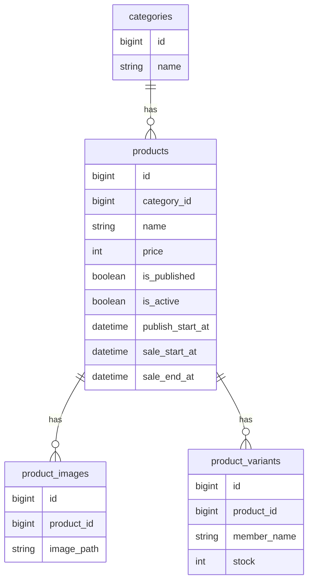

# 🛍️ Shining Will Shop

Laravel + Filament を用いて開発した ECサイトシステムです。

商品状態、販売期間、在庫状態を組み合わせた業務ロジックを実装し、管理画面を含めて構築しました。

単なる CRUD アプリではなく、

* 商品状態管理
* 販売期間制御
* 在庫管理
* ドメインロジック設計
* 管理画面構築

など、実務を意識した設計を行っています。

---

# 🎯 開発背景

ECサイトでは、

* 販売開始前の商品を表示したい
* 販売期間を制御したい
* 在庫切れ時に購入不可にしたい
* 商品状態と販売状態を管理したい

など、複数の条件を考慮した業務ロジックが必要になります。

本プロジェクトでは、

「商品状態 × 販売期間 × 在庫状態」

を組み合わせたシステムを設計・実装しました。

---

# 🛠 技術スタック

## Backend

* PHP 8.3
* Laravel 11

## Admin

* Filament v3

## Frontend

* Blade
* TailwindCSS

## Database

* MySQL

## Infrastructure

* Ubuntu
* Nginx
* Docker
* ConoHa VPS

## Version Control

* Git
* GitHub

---

# ⭐ 主な機能

## 商品管理

* 商品CRUD
* SKU管理
* カテゴリ管理
* 商品画像管理

## 在庫管理

* バリアント単位在庫管理
* 在庫合計自動計算
* SOLD OUT判定

## 販売管理

* 掲載開始日時管理
* 販売開始日時管理
* 販売終了日時管理
* 商品状態管理

## 管理画面

* Filamentによる管理画面
* 商品管理
* 在庫管理
* カテゴリ管理

---

# 🧠 コア設計

## 商品状態

商品は以下の状態を持ちます。

```text
掲載前
↓
販売前
↓
販売中
↓
販売終了
```

状態に応じて、

* 表示可否
* 購入可否

を制御しています。

---

## 購入可能判定

```text
表示中
↓
販売ON
↓
販売期間内
↓
在庫あり

＝購入可能
```

複数条件を統合し、業務要件をコードで表現しています。

---

## 在庫管理

商品単位ではなく、

「バリアント単位」

で在庫を管理しています。

合計在庫は動的に集計しています。

```php
public function totalStock(): int
{
    return (int)$this->variants()->sum('stock');
}
```

---

## 販売期間制御

```text
publish_start_at

掲載開始

sale_start_at

販売開始

sale_end_at

販売終了
```

時間を軸にシステムの挙動を制御しています。

---

# 📊 ER図



---

# 🖼 システム構成

```text
Internet
    ↓
Nginx
    ↓
Laravel
    ↓
MySQL
```

---

# 👨‍💻 工夫したポイント

## ① 商品状態 × 販売期間 × 在庫状態の統合

以下を組み合わせて購入可否を判定しています。

* 商品状態
* 販売期間
* 在庫状態

業務ロジックをモデルに集約することで保守性を高めています。

---

## ② ドメインロジックを Model に集約

Model に

* isAvailableForSale()
* isSoldOut()
* saleStatusLabel()

などを実装し、

業務知識をコードで表現しています。

---

## ③ Filament による管理画面構築

管理者が直感的に操作できるよう、

* 商品管理
* カテゴリ管理
* 在庫管理

を GUI で行えるようにしました。

---

## ④ 責務分離を意識した設計

* Controller
* Service
* Model
* View

の責務を分離し、

保守性や拡張性を意識した構成としています。

---

# 🚀 サーバー構築

ConoHa VPS 上に公開環境を構築しました。

構成

```text
Ubuntu
Nginx
PHP8.3
MySQL
Docker
```

担当内容

* Docker環境構築
* Nginx設定
* Laravelデプロイ
* ドメイン設定
* HTTPS化
* 公開環境構築

企画からサーバー公開まで一人で担当しました。

---

# 📁 ディレクトリ構成

```text
app
 ├ Models
 ├ Services
 ├ Http
 │   ├ Controllers
 │   └ Requests
 └ Providers

resources
 ├ views
 ├ components
 └ layouts

routes
 ├ web.php
 └ admin.php
```

---

# 🚧 現在の実装状況

| 機能     | 状態 |
| ------ | -- |
| 商品管理   | ✅  |
| カテゴリ管理 | ✅  |
| 在庫管理   | ✅  |
| 販売期間管理 | ✅  |
| 商品状態管理 | ✅  |
| 管理画面   | ✅  |
| カート機能  | 🚧 |
| 注文管理   | 🚧 |
| 決済機能   | 🚧 |

---

# 🚀 今後の改善

* カート機能

* 注文管理

* Stripe決済

* 会員制システム連携

* AWS構成

  * S3
  * CloudFront
  * RDS

* GitHub ActionsによるCI/CD

* 自動テスト追加

---

# 🔗 GitHub

```text
https://github.com/xxxx/shining-will-shop
```

---

# 📝 まとめ

本プロジェクトでは、

* 商品状態
* 販売期間
* 在庫状態

を組み合わせた業務ロジックを実装しました。

単なる CRUD アプリではなく、

「条件に応じてシステムの振る舞いを制御する設計」

を意識し、保守性・拡張性を考慮した実務志向の EC システムとして開発しました。

また、アプリケーション開発だけでなく、

* サーバー構築
* Docker環境構築
* Nginx設定
* ドメイン設定
* HTTPS化
* 公開環境構築

まで一貫して担当しました。
