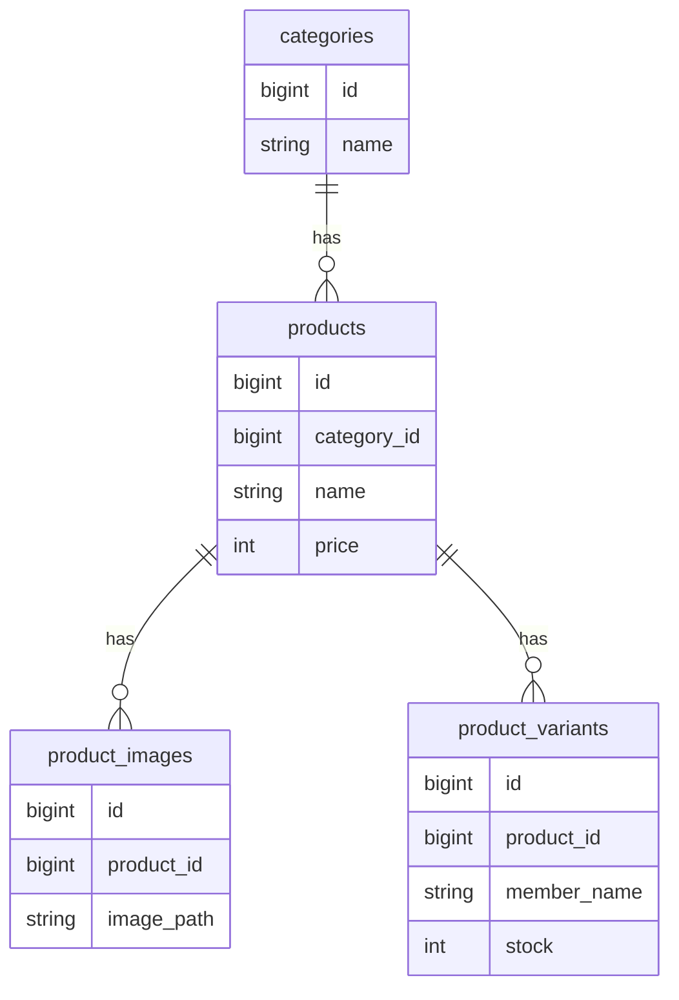

# 🛍️ Shining Will Shop

Laravel + Filament を用いて開発したアイドルグッズ販売向けECサイトです。

商品状態・販売期間・在庫状態を組み合わせた業務ロジックを実装し、
管理画面を含めた実運用を意識したシステムとして開発しました。

# 📌 このプロジェクトで証明できること

- Laravelを用いたバックエンド開発
- 業務ロジックを考慮したドメイン設計
- Filamentによる管理画面構築
- Modelへの責務集約
- Dockerを用いた開発環境構築
- Linux / Nginx / MySQL によるサーバー構築
- VPSへのデプロイ


# 🎯 開発背景

ECサイトでは、

- 販売前の商品を表示したい
- 販売期間を自動制御したい
- 在庫切れ時は購入できなくしたい

など、単純なCRUDでは表現できない業務要件があります。

本プロジェクトでは、

「商品状態 × 販売期間 × 在庫」

を組み合わせた業務ロジックを設計し、
実運用を意識したECサイトを開発しました。

# 🏗 システム構成

```text
Internet
    ↓
Nginx
    ↓
Laravel 11
    ↓
MySQL
```

# 🛠 技術スタック

|分類|技術|
|---|---|
|Language|PHP 8.3|
|Framework|Laravel 11|
|Admin|Filament v3|
|Frontend|Blade / TailwindCSS|
|Database|MySQL|
|Web Server|Nginx|
|OS|Ubuntu|
|Container|Docker|
|Version Control|Git / GitHub|
|Server|ConoHa VPS|


# ⭐ 主な機能

## 商品管理

- 商品登録
- 商品編集
- 商品削除
- カテゴリ管理
- 商品画像管理

## 在庫管理

- バリアント単位在庫管理
- 合計在庫自動計算
- SOLD OUT判定

## 販売管理

- 掲載開始日時
- 販売開始日時
- 販売終了日時
- 商品状態管理
- 購入可否判定

## 管理画面

Filamentによる管理UI

# 🧠 コア設計

本プロジェクトでは、単純なCRUDではなく、

「状態 × 時間 × 在庫」

を組み合わせた業務ロジックを設計しています。

---

## 商品状態管理

商品は以下の状態を持ちます。

```text
掲載前
↓
販売前
↓
販売中
↓
販売終了
```

状態に応じて、

- 表示可否
- 購入可否

を制御しています。

商品状態は日時や公開状態と連動して動作し、
ユーザーに表示される商品と購入可能な商品を分離しています。

---

## 購入可能判定

購入可能かどうかは、複数の条件を組み合わせて判定しています。

```text
公開中
↓
販売中
↓
販売期間内
↓
在庫あり

＝購入可能
```

実際には、

- 商品が公開状態である
- 販売開始日時を過ぎている
- 販売終了日時前である
- 在庫が存在する

すべての条件を満たした場合のみ購入可能となります。

```php
public function isAvailableForSale(): bool
{
    return
        $this->is_published
        && $this->is_active
        && now()->between(
            $this->sale_start_at,
            $this->sale_end_at
        )
        && $this->totalStock() > 0;
}
```

複数条件を統合することで、業務要件をコードとして表現しています。

---

## 在庫管理

商品単位ではなく、

「バリアント単位」

で在庫を管理しています。

例

- 生写真A
- 生写真B
- 生写真C

それぞれ独立した在庫を持ちます。

合計在庫は必要なタイミングで動的に算出しています。

```php
public function totalStock(): int
{
    return (int) $this->variants()
        ->sum('stock');
}
```

これにより、

- 在庫データの重複防止
- 集計値の不整合防止
- 保守性向上

を実現しています。

---

## 販売期間制御

販売期間は以下の日時で管理しています。

```text
publish_start_at → 掲載開始

sale_start_at → 販売開始

sale_end_at → 販売終了
```

時間を軸にシステムの挙動を制御しています。

### 掲載前

```text
現在時刻 < publish_start_at
```

- 非表示

---

### 販売前

```text
publish_start_at ～ sale_start_at
```

- 商品は表示
- 購入不可

---

### 販売中

```text
sale_start_at ～ sale_end_at
```

- 商品表示
- 購入可能

---

### 販売終了

```text
現在時刻 > sale_end_at
```

- 商品表示
- 購入不可

---

## ドメインロジックをModelに集約

Controllerに業務ロジックを書かず、

Modelに集約しています。

```php
isAvailableForSale()

isSoldOut()

saleStatusLabel()

totalStock()
```

これにより、

- Controllerの肥大化防止
- 再利用性向上
- 保守性向上

を意識した設計を行っています。

---

## 責務分離

処理ごとの責務を分離しています。

```text
Controller
↓
Service
↓
Model
↓
Repository
```

各層を分離することで、

- 保守性
- 拡張性
- テスト容易性

を意識した構成としています。

単なるCRUDアプリではなく、

「状態 × 時間 × データ」

によってシステムの振る舞いを制御することを重視した設計となっています。

# 📊 ER図



工夫したポイント
状態 × 時間 × 在庫の統合
ドメインロジックをModelへ集約
Filament採用
責務分離

# 🚀 サーバー構築

- Ubuntu
- Nginx
- PHP8.3
- MySQL8
- Docker

個人でVPSを契約し、
Linux環境でサーバー構築から公開まで実施しました。

# 🔥 今後追加予定

- カート機能
- 注文管理
- Stripe決済
- AWS移行
- S3
- CloudFront
- RDS

# 📝 まとめ

本プロジェクトでは、

- 商品状態
- 販売期間
- 在庫管理

を組み合わせた業務ロジックを実装しました。

単なるCRUDではなく、

「状態 × 時間 × データによってシステムの振る舞いを制御する設計」

を意識して開発しています。

また、

- Laravel
- Filament
- Docker
- Linux
- Nginx
- MySQL
- VPS公開

まで一貫して担当し、開発から運用までを経験しました。
