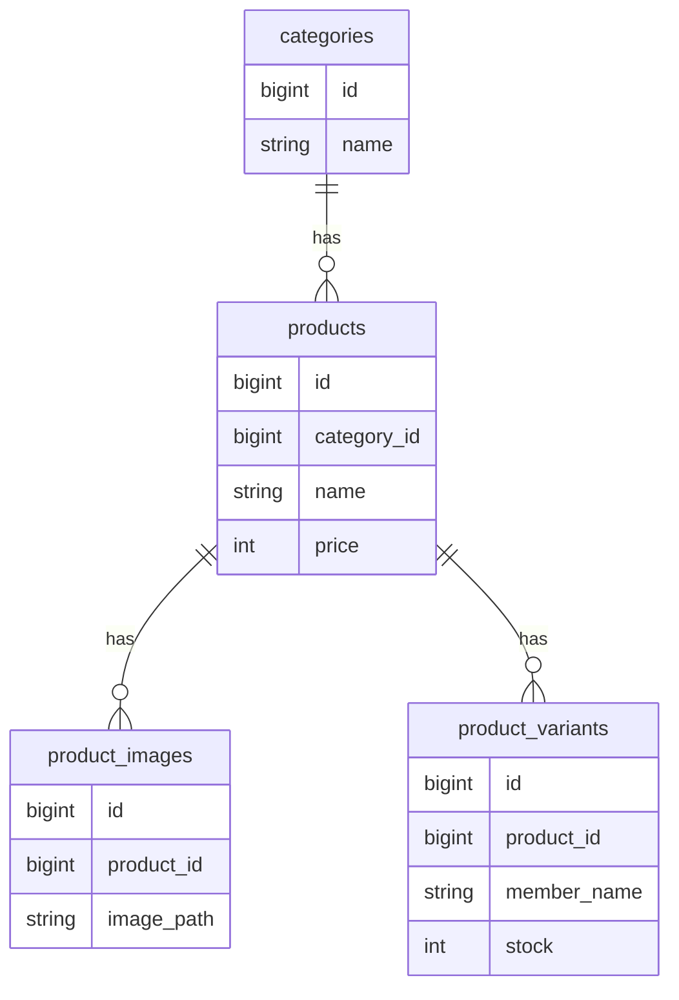

# 🛍️ Shining Will Shop

Laravel + Filament を用いて開発したアイドルグッズ販売向けECサイトです。

商品状態・販売期間・在庫状態を組み合わせた業務ロジックを実装し、
管理画面を含めた実運用を意識したシステムとして開発しました。

# 📌 このプロジェクトで証明できること

- Laravelを用いたバックエンド開発
- 業務ロジックを考慮したドメイン設計
- Filamentによる管理画面構築
- Modelへの責務集約
- Dockerを用いた開発環境構築
- Linux / Nginx / MySQL によるサーバー構築
- VPSへのデプロイ


# 🎯 開発背景

ECサイトでは、

- 販売前の商品を表示したい
- 販売期間を自動制御したい
- 在庫切れ時は購入できなくしたい

など、単純なCRUDでは表現できない業務要件があります。

本プロジェクトでは、

「商品状態 × 販売期間 × 在庫」

を組み合わせた業務ロジックを設計し、
実運用を意識したECサイトを開発しました。

# 🏗 システム構成

```text
Internet
    ↓
Nginx
    ↓
Laravel 11
    ↓
MySQL
```

# 🛠 技術スタック

|分類|技術|
|---|---|
|Language|PHP 8.3|
|Framework|Laravel 11|
|Admin|Filament v3|
|Frontend|Blade / TailwindCSS|
|Database|MySQL|
|Web Server|Nginx|
|OS|Ubuntu|
|Container|Docker|
|Version Control|Git / GitHub|
|Server|ConoHa VPS|


# ⭐ 主な機能

## 商品管理

- 商品登録
- 商品編集
- 商品削除
- カテゴリ管理
- 商品画像管理

## 在庫管理

- バリアント単位在庫管理
- 合計在庫自動計算
- SOLD OUT判定

## 販売管理

- 掲載開始日時
- 販売開始日時
- 販売終了日時
- 商品状態管理
- 購入可否判定

## 管理画面

Filamentによる管理UI

7. コア設計
商品状態管理
購入可能判定
在庫管理
販売期間制御

# 📊 ER図



工夫したポイント
状態 × 時間 × 在庫の統合
ドメインロジックをModelへ集約
Filament採用
責務分離

# 🚀 サーバー構築

- Ubuntu
- Nginx
- PHP8.3
- MySQL8
- Docker

個人でVPSを契約し、
Linux環境でサーバー構築から公開まで実施しました。

# 🔥 今後追加予定

- カート機能
- 注文管理
- Stripe決済
- AWS移行
- S3
- CloudFront
- RDS

# 📝 まとめ

本プロジェクトでは、

- 商品状態
- 販売期間
- 在庫管理

を組み合わせた業務ロジックを実装しました。

単なるCRUDではなく、

「状態 × 時間 × データによってシステムの振る舞いを制御する設計」

を意識して開発しています。

また、

- Laravel
- Filament
- Docker
- Linux
- Nginx
- MySQL
- VPS公開

まで一貫して担当し、開発から運用までを経験しました。
