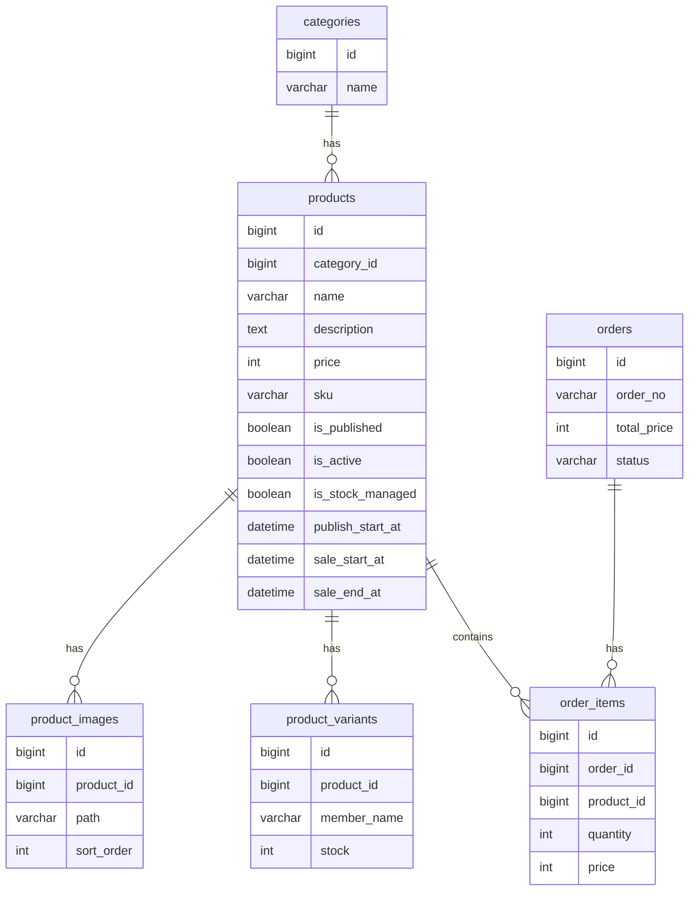
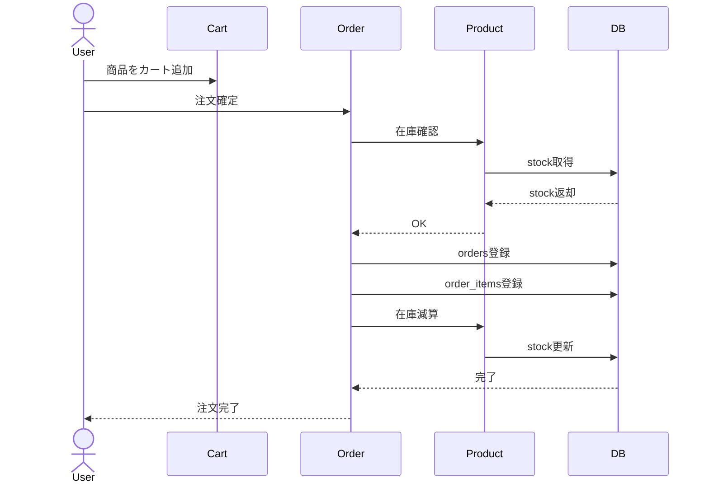
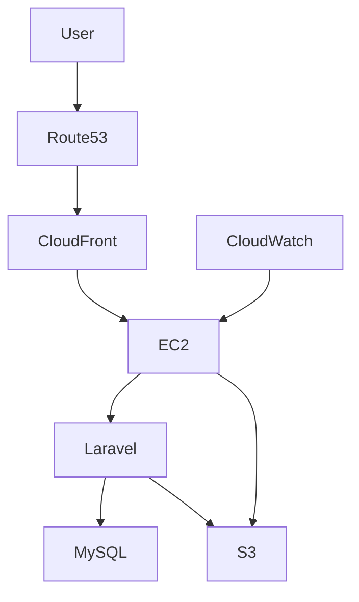
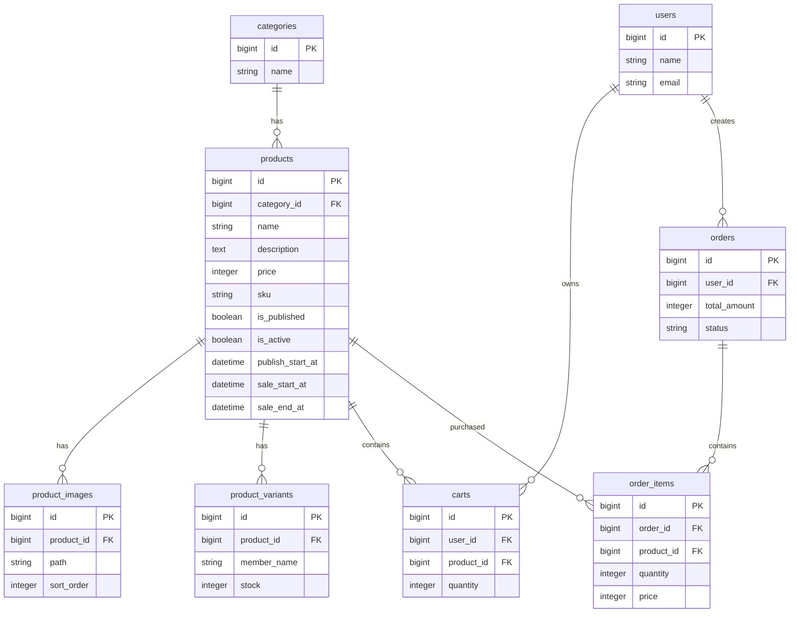
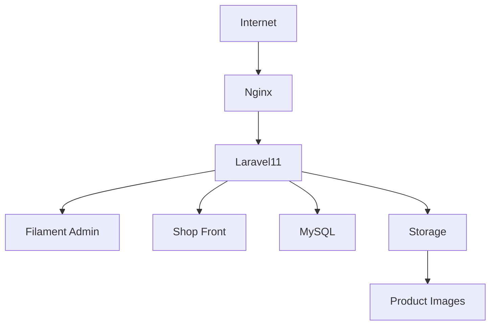
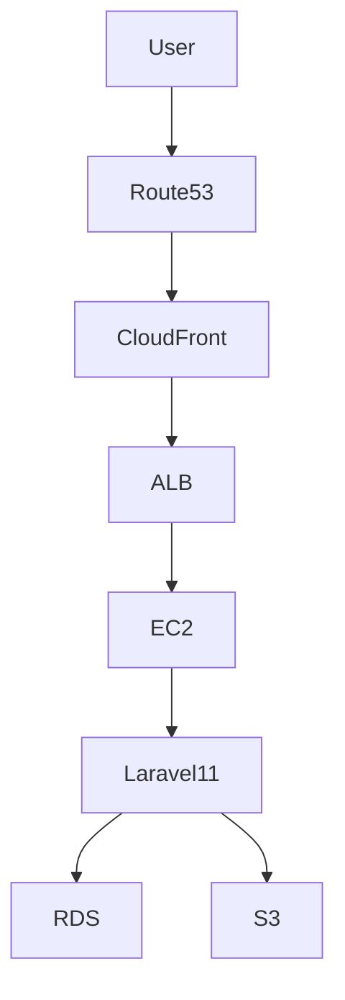

# Shining Will Shop

Laravel11 + Filament v3 による公式ECサイト

---

# 概要

Shining Will Shop は、アイドルグッズ販売を目的とした EC サイトです。

Laravel11 + Filament v3 を利用して構築しており、

- 商品管理
- カテゴリ管理
- 商品画像管理
- 在庫管理
- 販売期間管理
- 注文管理（予定）
- FanClub連携（予定）

を行います。

---

# 使用技術

## Backend

- Laravel 11

## Admin

- Filament v3

## Front

- Blade
- TailwindCSS

## Database

- MySQL

## Server

- Ubuntu
- Nginx

## Version Control

- Git
- GitHub

---

# ディレクトリ構成

```text
app/
├── Filament/
│   ├── Resources/
│   │   ├── ProductResource
│   │   ├── CategoryResource
│   │   └── ProductVariantResource
│   └── Pages

resources/views/

routes/web.php

public/

storage/

database/migrations/
```

---

# 本番環境

OS

```text
Ubuntu
```

WEB

```text
Nginx
```

DB

```text
MySQL
```

PHP

```text
PHP8.x
```

管理画面

```text
Filament v3
```

プロジェクト

```text
/var/www/shining-will-shop
```

公開ディレクトリ

```text
/var/www/shining-will-shop/public
```

---

# システム構成

```text
Internet
    ↓

Nginx

    ↓

Laravel11

    ↓

MySQL
```

---

# サーバー構築

## apt更新

```bash
apt update
apt upgrade -y
```

---

## Nginx

インストール

```bash
apt install nginx -y
```

確認

```bash
systemctl status nginx
```

---

## PHP

インストール

```bash
apt install php-fpm php-cli php-mysql php-curl php-mbstring php-xml php-zip php-gd unzip -y
```

確認

```bash
php -v
```

---

## Composer

インストール

```bash
apt install composer -y
```

確認

```bash
composer -V
```

---

## MySQL

インストール

```bash
apt install mysql-server -y
```

確認

```bash
systemctl status mysql
```

---

# Database作成

```sql
CREATE DATABASE shining_will_shop
CHARACTER SET utf8mb4
COLLATE utf8mb4_unicode_ci;
```

---

# Laravel配置

```bash
cd /var/www

git clone <repository-url> shining-will-shop
```

---

# .env作成

```bash
cp .env.example .env
```

APP_KEY生成

```bash
php artisan key:generate
```

---

# Storage Link

```bash
php artisan storage:link
```

---

# Migration

```bash
php artisan migrate
```

---

# Nginx設定

設定ファイル

```text
/etc/nginx/sites-available/shining-will-shop
```

内容

```nginx
server {

    listen 80;

    server_name _;

    root /var/www/shining-will-shop/public;

    index index.php;

    location / {
        try_files $uri $uri/ /index.php?$query_string;
    }

    location ~ \.php$ {
        include snippets/fastcgi-php.conf;
        fastcgi_pass unix:/run/php/php8.3-fpm.sock;
    }

    location ~ /\.ht {
        deny all;
    }
}
```

有効化

```bash
ln -s \
/etc/nginx/sites-available/shining-will-shop \
/etc/nginx/sites-enabled/
```

確認

```bash
nginx -t
```

再起動

```bash
systemctl restart nginx
```

---

# デプロイ手順

最新版取得

```bash
git pull origin main
```

依存更新

```bash
composer install --no-dev --optimize-autoloader
```

Migration

```bash
php artisan migrate --force
```

キャッシュ削除

```bash
php artisan optimize:clear
```

Filamentキャッシュ削除

```bash
php artisan filament:clear
```

権限設定

```bash
chown -R www-data:www-data storage bootstrap/cache

chmod -R 775 storage bootstrap/cache
```

---

# よく使うコマンド

キャッシュ削除

```bash
php artisan optimize:clear
```

Filament

```bash
php artisan filament:clear
```

ルート確認

```bash
php artisan route:list
```

Migration確認

```bash
php artisan migrate:status
```

ログ確認

```bash
tail -f storage/logs/laravel.log
```

Nginxログ

```bash
tail -f /var/log/nginx/error.log
```

# データベース構成

---

# categories

商品カテゴリ

| Column | Type |
|----------|------|
| id | bigint |
| name | varchar |
| created_at | datetime |
| updated_at | datetime |

---

# products

商品マスタ

| Column | Type |
|---------|------|
| id | bigint |
| category_id | bigint |
| name | varchar |
| description | text |
| price | int |
| sku | varchar |
| is_published | boolean |
| is_active | boolean |
| is_stock_managed | boolean |
| is_delivery_required | boolean |
| publish_start_at | datetime |
| sale_start_at | datetime |
| sale_end_at | datetime |
| created_at | datetime |
| updated_at | datetime |

---

# product_images

商品画像

| Column | Type |
|---------|------|
| id | bigint |
| product_id | bigint |
| path | varchar |
| sort_order | int |
| created_at | datetime |
| updated_at | datetime |

---

# product_variants

個別在庫

| Column | Type |
|---------|------|
| id | bigint |
| product_id | bigint |
| member_name | varchar |
| stock | int |
| created_at | datetime |
| updated_at | datetime |

---

# Productモデル

```php
class Product extends Model
{
    use HasFactory;

    protected $fillable = [
        'category_id',
        'name',
        'description',
        'price',
        'sku',
        'is_published',
        'is_active',
        'is_stock_managed',
        'is_delivery_required',
        'publish_start_at',
        'sale_start_at',
        'sale_end_at',
    ];
}
```

---

# リレーション

## Category

```php
public function category()
{
    return $this->belongsTo(Category::class);
}
```

---

## Images

```php
public function images()
{
    return $this->hasMany(ProductImage::class)
        ->orderBy('sort_order');
}
```

---

## Variants

```php
public function variants()
{
    return $this->hasMany(ProductVariant::class);
}
```

---

# 公開判定

```php
public function isVisibleOnStore(): bool
{
    if (! $this->is_published) {
        return false;
    }

    if (
        $this->publish_start_at &&
        $this->publish_start_at->isFuture()
    ) {
        return false;
    }

    return true;
}
```

条件

- is_published = true
- publish_start_at 到達済

---

# 販売開始前判定

```php
public function isBeforeSale(): bool
{
    return
        $this->sale_start_at &&
        $this->sale_start_at->isFuture();
}
```

---

# 販売終了判定

```php
public function isAfterSale(): bool
{
    return
        $this->sale_end_at &&
        $this->sale_end_at->isPast();
}
```

---

# 販売期間判定

```php
public function isWithinSalePeriod(): bool
{
    return
        ! $this->isBeforeSale()
        &&
        ! $this->isAfterSale();
}
```

---

# 在庫合計

```php
public function totalStock(): int
{
    if (! $this->is_stock_managed) {
        return 9999;
    }

    return (int)
        $this->variants()
             ->sum('stock');
}
```

例

```text
Bety      20
うり      15
全員集合   5
------------
合計      40
```

---

# 売り切れ判定

```php
public function isSoldOut(): bool
{
    return $this->totalStock() <= 0;
}
```

---

# 購入可能判定

```php
public function isAvailableForSale(): bool
{
    if (! $this->isVisibleOnStore()) {
        return false;
    }

    if (! $this->is_active) {
        return false;
    }

    if (! $this->isWithinSalePeriod()) {
        return false;
    }

    if (
        $this->is_stock_managed &&
        $this->isSoldOut()
    ) {
        return false;
    }

    return true;
}
```

判定条件

```text
表示中
↓
販売ON
↓
販売期間内
↓
在庫あり

＝購入可能
```

---

# 販売状態ラベル

```php
public function saleStatusLabel(): string
{
    if (! $this->isVisibleOnStore()) {
        return '非公開';
    }

    if ($this->isBeforeSale()) {
        return '掲載前';
    }

    if ($this->isAfterSale()) {
        return '販売終了';
    }

    return '販売中';
}
```

---

# 商品画像管理

1商品に複数画像登録可能

```php
public function images()
{
    return $this->hasMany(ProductImage::class)
        ->orderBy('sort_order');
}
```

管理画面から

- アップロード
- 並び替え

可能

---

# 現在の販売仕様

## 掲載前

```text
商品非表示
```

---

## 掲載後 ＆ 販売開始前

```text
商品ページ表示

○月○日○時から販売開始

購入不可
```

---

## 販売中

```text
購入可能
```

---

## 販売終了後

```text
販売終了

購入不可
```

---

# 在庫管理仕様

在庫管理ON

```php
is_stock_managed = true
```

個別在庫

```text
Bety      10
うり      5
全員集合   2
```

↓

```text
合計17
```

在庫0

↓

```text
SOLD OUT
```

# Filament 管理画面

管理画面URL

```text
http://サーバーIP/shiningadmin
```

---

# ProductResource

管理項目

- 商品名
- 商品説明
- 価格
- SKU
- カテゴリ
- 商品画像
- 公開設定
- 販売設定
- 掲載開始日時
- 販売開始日時
- 販売終了日時

---

# 商品作成画面

## 基本情報

```php
name
description
price
category_id
sku
```

---

## SKU自動生成

```php
->default(
    fn () => 'SKU-' . Str::upper(Str::random(6))
)
```

例

```text
SKU-3HF92D
```

---

# 商品画像

1商品に複数画像登録可能

```php
Repeater::make('images')
    ->relationship('images')
```

項目

```php
path
sort_order
```

画像アップロード

```php
FileUpload::make('path')
    ->image()
    ->directory('products')
```

並び順

```php
sort_order
```

---

# 公開設定

表示ON/OFF

```php
is_published
```

Filament

```php
Toggle::make('is_published')
```

---

# 販売設定

購入可能ON/OFF

```php
is_active
```

Filament

```php
Toggle::make('is_active')
```

---

# 販売期間

掲載開始

```php
publish_start_at
```

販売開始

```php
sale_start_at
```

販売終了

```php
sale_end_at
```

Filament

```php
DateTimePicker::make()
```

---

# 商品一覧

表示項目

```php
商品名
価格
販売状態
表示状態
販売状態
```

---

# 販売状態

表示

```text
掲載前
販売前
販売中
販売終了
```

---

# 販売状態ラベル

```php
saleStatusLabel()
```

返却値

```php
非公開

掲載前

販売中

販売終了
```

---

# 商品ページ仕様

## ①掲載前

```text
商品非表示
```

---

## ②掲載後 ＆ 販売開始前

商品ページ表示

表示

```text
〇月〇日〇時から販売開始
```

購入不可

カートボタン非表示

---

## ③販売中

購入可能

```text
カートに入れる
```

表示

---

## ④販売終了

商品ページ表示

表示

```text
販売終了
```

購入不可

---

# 売り切れ

在庫0

↓

```text
SOLD OUT
```

表示

購入不可

---

# 商品画像スライダー

Swiper使用

```javascript
new Swiper('.mySwiper', {
    loop: true,
    pagination: {
        el: '.swiper-pagination',
        clickable: true,
    },
});
```

---

# ProductVariant

個別在庫

```php
member_name
stock
```

例

```text
Bety        20

うり        15

全員集合     5
```

合計

```text
40
```

---

# ManageVariants

目的

商品ごとに在庫管理

URL

```text
/products/{record}/variants
```

画面

```text
商品情報

メンバー別在庫

Bety       20

うり       15

全員集合    5
```

追加

編集

削除

可能

---

# Repeater

```php
Repeater::make('variants')
    ->relationship()
```

項目

```php
member_name

stock
```

---

# 在庫保存ボタン

```php
Action::make('save')
    ->submit('save')
```

---

# 現在発生したエラー

## ①

```text
Method getRecord does not exist
```

原因

ListRecords使用

---

## ②

```text
View [pages.edit-record] not found
```

原因

view設定誤り

---

## ③

```text
Method route does not exist
```

原因

ManageVariantsのroute定義不整合

---

## ④

```text
Call to a member function getPage() on string
```

原因

ProductResource

getPages()

で

NG

```php
'variants' => Pages\ManageVariants::class
```

---

正

```php
'variants' => Pages\ManageVariants::route(
    '/{record}/variants'
)
```

---

## ⑤

404

```text
/products/17/variants
```

原因調査中

---

# よく使うコマンド

キャッシュ削除

```bash
php artisan optimize:clear
```

Filament

```bash
php artisan filament:clear
```

ルート一覧

```bash
php artisan route:list
```

Migration確認

```bash
php artisan migrate:status
```

ログ確認

```bash
tail -f storage/logs/laravel.log
```

Nginxログ

```bash
tail -f /var/log/nginx/error.log
```

---

# 現在の完成度

### 商品CRUD

✅

---

### カテゴリ管理

✅

---

### 商品画像

✅

---

### 掲載開始時間

✅

---

### 販売開始時間

✅

---

### 販売終了時間

✅

---

### 公開設定

✅

---

### 販売設定

✅

---

### 販売状態判定

✅

---

### 在庫合計

✅

---

### SOLD OUT判定

✅

---

### 購入可能判定

✅

---

### 商品詳細ページ

✅

---

### Swiper画像

✅

---

### 商品別在庫管理

⚠ 復旧中

---

### 注文管理

未実装

---

### 決済機能

未実装

---

### FanClub連携

未実装

---

# 次に作る機能

優先順位

① ManageVariants復旧

↓

② カート機能

↓

③ 注文機能

↓

④ 決済機能

↓

⑤ 注文履歴

↓

⑥ 会員限定販売

↓

⑦ FanClub連携

↓

v1.0完成

# ER図



---

# 注文シーケンス図



---

# AWS構成図



---

# 本番構成

```text
Internet
      ↓

Nginx
      ↓

Laravel11
      ↓

MySQL
```

画像

```text
storage/app/public/products
```

管理画面

```text
/ shinningadmin
```

---

# Git運用

main

```text
本番環境
```

develop

```text
開発環境
```

feature

```text
機能開発
```

例

```text
feature/cart

feature/order

feature/payment
```

---

# デプロイフロー

```text
feature

↓

develop

↓

main

↓

git pull

↓

composer install

↓

php artisan migrate

↓

php artisan optimize:clear

↓

本番反映
```

---

# バックアップ

DB

```bash
mysqldump -u root -p shining_will_shop > backup.sql
```

復元

```bash
mysql -u root -p shining_will_shop < backup.sql
```

---

# ストレージ

リンク生成

```bash
php artisan storage:link
```

権限

```bash
chmod -R 775 storage

chmod -R 775 bootstrap/cache

chown -R www-data:www-data storage

chown -R www-data:www-data bootstrap/cache
```

---

# 今後実装予定

## Cart

テーブル

```text
carts
cart_items
```

機能

- カート追加
- 数量変更
- 削除

---

## Order

テーブル

```text
orders
order_items
```

機能

- 注文確定
- 注文履歴
- ステータス管理

---

## 決済

候補

### Stripe

機能

- クレジットカード
- Apple Pay
- Google Pay

---

## FanClub連携

会員限定販売

products

追加予定

```php
is_members_only
```

判定

```php
if ($user->is_member)
{
    表示
}
```

---

# 管理画面ロードマップ

## v1.0

- 商品管理
- カテゴリ管理
- 商品画像管理
- 販売期間管理
- 在庫管理
- カート機能
- 注文管理

---

## v1.1

- Stripe決済
- メール通知
- 注文履歴

---

## v1.2

- FanClub会員限定販売
- クーポン
- お気に入り

---

## v2.0

- LINEログイン
- デジタル会員証連携
- チケット販売
- ガチャ機能

---

# 現在の完成度

| 機能 | 状態 |
|-------|------|
| 商品CRUD | ✅ |
| カテゴリ管理 | ✅ |
| 商品画像 | ✅ |
| 販売期間管理 | ✅ |
| 公開設定 | ✅ |
| 購入可否判定 | ✅ |
| 在庫合計 | ✅ |
| SOLD OUT判定 | ✅ |
| 商品詳細ページ | ✅ |
| Swiper | ✅ |
| 商品別在庫管理 | ⚠復旧中 |
| カート機能 | 未実装 |
| 注文機能 | 未実装 |
| Stripe決済 | 未実装 |
| FanClub連携 | 未実装 |

---

# 現在の最優先課題

### ① ManageVariants復旧

```text
/products/{record}/variants
```

個別在庫編集

---

### ② Cart機能

- カート追加
- 数量変更
- 削除

---

### ③ Order機能

- 注文作成
- 注文明細

---

### ④ Stripe決済

- クレジットカード

---

### ⑤ FanClub連携

会員限定販売

---

# 最終目標

Shining Will公式ショップ

Laravel11 + Filament v3

- 商品管理
- 在庫管理
- 注文管理
- 決済
- FanClub連携

を備えた本番運用可能なECサイトを完成させる。

# コード保管庫

この章は、壊れた時の復旧用コード集。

---

# Product.php

役割

* 販売期間判定
* 在庫判定
* 購入可能判定
* リレーション

## リレーション

```php
public function category()
{
    return $this->belongsTo(Category::class);
}

public function images()
{
    return $this->hasMany(ProductImage::class)
        ->orderBy('sort_order');
}

public function variants()
{
    return $this->hasMany(ProductVariant::class);
}
```

---

## 公開判定

```php
isVisibleOnStore()
```

条件

* is_published=true
* publish_start_at到達済

---

## 販売開始前

```php
isBeforeSale()
```

---

## 販売終了

```php
isAfterSale()
```

---

## 販売期間内

```php
isWithinSalePeriod()
```

---

## 在庫合計

```php
totalStock()
```

---

## 売り切れ判定

```php
isSoldOut()
```

---

## 購入可能判定

```php
isAvailableForSale()
```

---

## 販売状態ラベル

```php
saleStatusLabel()
```

---

# ProductVariant.php

```php
fillable

product_id

member_name

stock
```

リレーション

```php
belongsTo(Product::class)
```

---

# ProductImage.php

```php
fillable

product_id

path

sort_order
```

---

# ProductResource

## Form

### 基本情報

```php
name

description

price

category_id

sku
```

---

### 商品画像

```php
Repeater::make('images')
```

項目

```php
path

sort_order
```

---

### 公開設定

```php
is_published
```

---

### 販売設定

```php
is_active
```

---

### 掲載開始

```php
publish_start_at
```

---

### 販売開始

```php
sale_start_at
```

---

### 販売終了

```php
sale_end_at
```

---

# ListProducts

URL

```text
/products
```

一覧表示

* 商品名
* 価格
* 販売状態
* 商品画像
* 掲載開始日時
* 販売開始日時
* 販売終了日時

---

# EditProduct

URL

```text
/products/{id}/edit
```

編集画面

---

# CreateProduct

URL

```text
/products/create
```

新規作成画面

---

# ManageVariants

目的

商品ごとの在庫管理

URL

```text
/products/{record}/variants
```

機能

* 在庫追加
* 編集
* 削除

項目

```php
member_name

stock
```

---

# ProductResource::getPages()

```php
index

create

edit

variants
```

---

# 商品ページ

## 掲載前

非表示

---

## 掲載後＆販売開始前

表示

```text
○月○日○時から販売開始
```

購入不可

---

## 販売中

購入可能

```text
カートに入れる
```

---

## 販売終了

表示

```text
販売終了
```

購入不可

---

# Swiper

画像スライダー

```javascript
new Swiper()
```

---

# Cart

予定

```text
carts

cart_items
```

---

# Order

予定

```text
orders

order_items
```

---

# Stripe

予定

* クレジットカード
* ApplePay

---

# FanClub連携

予定

```php
is_members_only
```

---

# 復旧時に最初に見る場所

Product.php

↓

ProductResource.php

↓

ManageVariants.php

↓

ProductVariant.php

↓

routes

↓

migration

↓

laravel.log

---

# 現在の課題

① ManageVariants復旧

```text
/products/{record}/variants
```

② 商品一覧の完全復旧

* 商品画像
* 掲載開始
* 販売開始
* 販売終了

③ Cart機能

④ Order機能

⑤ Stripe決済

⑥ FanClub連携

---

# 最終目標

Laravel11 + Filament v3

Shining Will公式ショップ完成

# Part6 トラブルシューティング集

この章は開発中に発生したエラーと解決方法をまとめたもの。

---

# ① Method getRecord does not exist

## エラー

```text
Method ManageVariants::getRecord does not exist
```

## 原因

```php
class ManageVariants extends ListRecords
```

なのに

```php
$this->getRecord()
```

を使用していた。

ListRecordsには getRecord() が存在しない。

---

## 解決方法

EditRecordを継承する。

```php
use Filament\Resources\Pages\EditRecord;

class ManageVariants extends EditRecord
{
}
```

そして

```php
$this->record
```

を使用する。

---

# ② Method route does not exist

## エラー

```text
Method ManageVariants::route does not exist
```

## 原因

ManageVariantsが

```php
Pages\ManageVariants::class
```

になっていた。

その状態で

```php
Pages\ManageVariants::route()
```

を呼んでいた。

---

## 解決方法

EditRecordを継承している場合

ProductResource.php

```php
'variants' => Pages\ManageVariants::route('/{record}/variants'),
```

とする。

---

# ③ Call to a member function getPage() on string

## エラー

```text
Call to a member function getPage() on string
```

## 原因

getPages()の定義が間違っていた。

NG

```php
'variants' => Pages\ManageVariants::class
```

文字列になってしまう。

---

## 正しい書き方

```php
public static function getPages(): array
{
    return [
        'index' => Pages\ListProducts::route('/'),
        'create' => Pages\CreateProduct::route('/create'),
        'edit' => Pages\EditProduct::route('/{record}/edit'),
        'variants' => Pages\ManageVariants::route('/{record}/variants'),
    ];
}
```

---

# ④ View [pages.edit-record] not found

## エラー

```text
View [pages.edit-record] not found
```

## 原因

ManageVariantsに

```php
protected static string $view = 'pages.edit-record';
```

や

```php
protected static string $view = 'filament::pages.edit-record';
```

を書いていた。

存在しないViewを指定していた。

---

## 解決方法

この記述を削除する。

削除するもの

```php
protected static string $view
```

---

# ⑤ 404 Not Found

## 原因

URLが登録されていない。

---

## 確認

```bash
php artisan route:list | grep variants
```

表示されればOK。

---

## ProductResource

```php
'variants' => Pages\ManageVariants::route('/{record}/variants'),
```

になっているか確認。

---

# ⑥ php artisan optimize:clear が失敗する

## 原因

Resourceに文法エラーがある。

もしくは

```php
Pages\ManageVariants::class
```

になっている。

---

## 解決

ProductResource.phpを修正。

その後

```bash
php artisan optimize:clear

php artisan filament:clear

php artisan route:clear

php artisan config:clear

php artisan cache:clear

php artisan view:clear
```

---

# ⑦ route:listで確認

在庫ページが存在するか確認。

```bash
php artisan route:list | grep variants
```

期待値

```text
GET|HEAD
shiningadmin/products/{record}/variants
```

---

# ⑧ relationship()エラー

## 原因

Productモデルに

```php
variants()
```

がない。

---

## Product.php

```php
public function variants()
{
    return $this->hasMany(ProductVariant::class);
}
```

---

# ⑨ 画像が保存できない

## Product.php

必要

```php
public function images()
{
    return $this->hasMany(ProductImage::class)
        ->orderBy('sort_order');
}
```

---

## ProductImage.php

fillable

```php
protected $fillable = [
    'product_id',
    'path',
    'sort_order',
];
```

---

## シンボリックリンク作成

```bash
php artisan storage:link
```

---

# ⑩ FileUploadで画像表示されない

確認

```bash
ls public/storage
```

無ければ

```bash
php artisan storage:link
```

---

# ⑪ SQLエラー

確認

```bash
php artisan migrate:status
```

未実行なら

```bash
php artisan migrate
```

---

# ⑫ laravel.log確認

場所

```bash
storage/logs/laravel.log
```

最新100行

```bash
tail -100 storage/logs/laravel.log
```

リアルタイム

```bash
tail -f storage/logs/laravel.log
```

---

# ⑬ キャッシュ全削除

最終手段

```bash
php artisan optimize:clear

php artisan route:clear

php artisan config:clear

php artisan cache:clear

php artisan view:clear

php artisan filament:clear
```

---

# ⑭ Composer再生成

```bash
composer dump-autoload
```

---

# ⑮ パーミッション修正

```bash
sudo chown -R www-data:www-data storage bootstrap/cache

sudo chmod -R 775 storage bootstrap/cache
```

---

# ⑯ Nginx再起動

設定反映

```bash
sudo systemctl restart nginx
```

確認

```bash
systemctl status nginx
```

---

# ⑰ PHP-FPM再起動

PHP8.3

```bash
sudo systemctl restart php8.3-fpm
```

確認

```bash
systemctl status php8.3-fpm
```

---

# ⑱ DB確認

接続

```bash
mysql -u root -p
```

DB一覧

```sql
SHOW DATABASES;
```

テーブル一覧

```sql
USE shining_will_shop;

SHOW TABLES;
```

---

# ⑲ 最初に疑う順番

① ProductResource.php

↓

② ManageVariants.php

↓

③ Product.php

↓

④ ProductVariant.php

↓

⑤ migration

↓

⑥ route:list

↓

⑦ optimize:clear

↓

⑧ laravel.log

↓

⑨ composer dump-autoload

↓

⑩ nginx/php-fpm再起動

---

# 現在の復旧優先順位

① ManageVariants完全復旧

② 商品一覧復旧

* 商品画像
* 掲載開始日時
* 販売開始日時
* 販売終了日時

③ Cart機能

④ 注文機能

⑤ Stripe決済

⑥ FanClub連携

⑦ 本番公開



categories
カラム	型
id	bigint
name	string
products
カラム	型
id	bigint
category_id	bigint
name	string
description	text
price	integer
sku	string
is_published	boolean
is_active	boolean
publish_start_at	datetime
sale_start_at	datetime
sale_end_at	datetime
created_at	timestamp
product_images
カラム	型
id	bigint
product_id	bigint
path	string
sort_order	integer
product_variants
カラム	型
id	bigint
product_id	bigint
member_name	string
stock	integer
carts
カラム	型
id	bigint
user_id	bigint
product_id	bigint
quantity	integer
orders
カラム	型
id	bigint
user_id	bigint
total_amount	integer
status	string
order_items
カラム	型
id	bigint
order_id	bigint
product_id	bigint
quantity	integer
price	integer



本番環境
OS

Ubuntu 24.04

Web Server

Nginx

PHP

PHP8.3

Framework

Laravel11

Admin

Filament v3

Database

MySQL 8

Storage

Laravel Storage

storage/app/public/products
Image公開
php artisan storage:link

↓

public/storage
Process
Nginx

↓

PHP-FPM

↓

Laravel

↓

MySQL
想定AWS構成

使用予定サービス
サービス	用途
EC2	Laravelサーバー
RDS MySQL	DB
S3	商品画像
CloudFront	CDN
Route53	DNS
ACM	SSL
ALB	ロードバランサ
Part9 API一覧
商品一覧取得
GET /products

Response

{
  "id": 1,
  "name": "生写真セット",
  "price": 2000
}
商品詳細
GET /products/{id}

Response

{
  "id":1,
  "name":"生写真セット",
  "description":"数量限定",
  "price":2000
}
カート追加
POST /cart/add

Request

{
  "product_id":1,
  "quantity":2
}

Response

{
  "success":true
}
カート一覧
GET /cart
注文作成
POST /orders

Request

{
  "items":[
    {
      "product_id":1,
      "quantity":2
    }
  ]
}
注文履歴
GET /orders
注文詳細
GET /orders/{id}
Stripe Checkout
POST /checkout

Response

{
    "checkout_url":"https://checkout.stripe.com/..."
}
管理画面API

商品一覧

GET /admin/products

商品作成

POST /admin/products

商品更新

PUT /admin/products/{id}

商品削除

DELETE /admin/products/{id}
将来的なFanClub API

会員情報

GET /fanclub/me

限定投稿一覧

GET /fanclub/posts

チャット取得

GET /fanclub/chats

スタンプ送信

POST /fanclub/stamps

ショップ連携

GET /fanclub/shop

ロードマップ・今後追加予定機能
v1.0（完成済み）
商品管理
商品CRUD
カテゴリ管理
SKU管理
商品画像複数登録
並び替え
販売期間
掲載開始日時
販売開始日時
販売終了日時
在庫管理
メンバー別在庫
総在庫数自動計算
SOLD OUT表示
カート機能
商品追加
数量変更
削除
注文機能
注文作成
注文履歴
注文明細
管理画面

Filament v3

v1.1
検索機能

商品名検索

キーワード検索
カテゴリ検索
価格帯検索
ソート
新着順
価格安い順
価格高い順
お気に入り機能
users
favorites
レビュー機能
レビュー投稿
星評価
平均評価表示
v1.2
Stripe決済
カード決済
Webhook
注文ステータス更新
メール通知

購入完了メール

OrderPlacedMail

発送完了メール

ShipmentMail
管理者通知
新規注文通知
在庫切れ通知
v2.0
FanClub連携

会員限定価格

一般価格 3000円

会員価格 2500円
会員限定商品
is_member_only
スタンプカード
購入回数
↓
特典付与
LINE風グループチャット
ユーザー
↓
タレント
↓
公式
アイテムショップ
背景変更
スタンプ購入
ディレクトリ構成
app/
 ├── Models
 ├── Http
 ├── Filament
 ├── Mail
 ├── Services
 ├── Jobs
 └── Notifications

resources/
 ├── views
 ├── css
 └── js

routes/
 ├── web.php
 └── api.php
Part11 Docker構成
docker-compose.yml
version: "3"

services:

  app:
    build:
      context: .
      dockerfile: Dockerfile

    container_name: laravel_app

    volumes:
      - .:/var/www

    depends_on:
      - mysql

  nginx:
    image: nginx:latest

    ports:
      - "80:80"

    volumes:
      - .:/var/www
      - ./docker/nginx:/etc/nginx/conf.d

    depends_on:
      - app

  mysql:
    image: mysql:8

    environment:
      MYSQL_DATABASE: shining_will_shop
      MYSQL_ROOT_PASSWORD: password

    ports:
      - "3306:3306"

volumes:
  mysql_data:
Dockerfile
FROM php:8.3-fpm

RUN apt-get update && apt-get install -y \
    git \
    zip \
    unzip \
    libzip-dev \
    libpng-dev

RUN docker-php-ext-install pdo_mysql zip gd

COPY --from=composer:latest /usr/bin/composer /usr/bin/composer

WORKDIR /var/www
起動
docker compose up -d
Laravelセットアップ
composer install

cp .env.example .env

php artisan key:generate

php artisan migrate

php artisan storage:link
コンテナ確認
docker ps
MySQL接続
DB_CONNECTION=mysql
DB_HOST=mysql
DB_PORT=3306
DB_DATABASE=shining_will_shop
DB_USERNAME=root
DB_PASSWORD=password
Part12 CI/CD・テスト・セキュリティ
GitHub Flow
main
 ↑
feature/xxx
 ↑
develop
開発フロー
feature/cart

↓

git add .

↓

git commit

↓

git push

↓

Pull Request

↓

Merge

↓

Deploy
GitHub Actions

.github/workflows/laravel.yml

name: Laravel CI

on:
  push:

jobs:

  laravel-tests:

    runs-on: ubuntu-latest

    steps:

      - uses: actions/checkout@v4

      - uses: shivammathur/setup-php@v2
        with:
          php-version: '8.3'

      - run: composer install

      - run: cp .env.example .env

      - run: php artisan key:generate

      - run: php artisan test
テスト
Unit Test
ProductTest
OrderTest
CartTest

実行

php artisan test
Feature Test
商品購入
商品表示

↓

カート追加

↓

注文

↓

在庫減少
販売期間
販売開始前

↓

購入不可
販売終了
販売終了後

↓

購入不可
セキュリティ
CSRF

Laravel標準

@csrf
パスワード

bcrypt

Hash::make()
SQLインジェクション対策

Eloquent ORM

Product::where()
XSS対策

Blade

{{ $name }}
認証

Laravel Auth

Auth::user()
管理画面

Filament

Authenticate::class
HTTPS

Let's Encrypt

Nginx
↓
SSL
↓
Laravel
今後追加したい技術
Redis

キャッシュ

Redis
↓
Cart
Session
Queue
Queue

メール送信

Dispatch

↓

Job

↓

Queue Worker
AWS
EC2
RDS
S3
CloudFront
Route53
ACM
監視

CloudWatch

CDN

CloudFront

オートスケール

ALB

↓

EC2 AutoScaling

最終構成
Laravel11
↓
Filament v3
↓
MySQL
↓
Nginx
↓
Ubuntu

商品管理
カテゴリ管理
画像管理
販売期間管理
在庫管理
カート
注文機能
Stripe決済（予定）
FanClub連携（予定）
Docker対応
GitHub Actions対応
AWS対応
