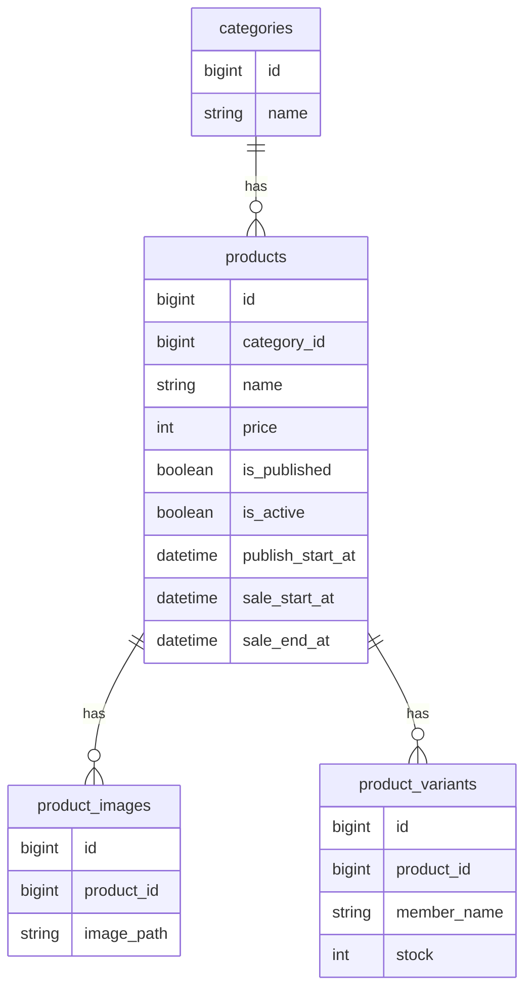

# 🛍️ Shining Will Shop

Laravel + Filament を用いて開発した、アイドルグッズ販売向けECサイトです。

単なるCRUDアプリではなく、

- 商品状態管理
- 販売期間管理
- 在庫管理
- 管理画面
- 業務ロジック設計

を重視し、実運用を意識した設計を行いました。

---

# 📌 このプロジェクトで証明できること

- Laravelを用いたバックエンド開発
- 業務ロジックを考慮したドメイン設計
- Filamentによる管理画面構築
- Modelへの責務集約
- 状態 × 時間 × 在庫を組み合わせた販売制御
- Dockerを利用した開発環境構築
- VPS上でのサーバー構築・公開
- Linux / Nginx / MySQL を用いた運用

---

# 🎯 開発背景

ECサイトでは、

- 販売前の商品を表示したい
- 販売期間を自動制御したい
- 在庫切れ時に購入できなくしたい
- 商品状態と販売状態を分離したい

など、単純なCRUDだけでは対応できない業務要件があります。

本プロジェクトでは、

「商品状態 × 販売期間 × 在庫」

を組み合わせた業務ロジックを設計し、実際のECサイトを意識したシステムを構築しました。

---

# 🏗 システム構成

```text
Internet
    ↓
Nginx
    ↓
Laravel 11
    ↓
MySQL
```

---

# 🛠 技術スタック

|分類|技術|
|---|---|
|Language|PHP 8.3|
|Framework|Laravel 11|
|Admin|Filament v3|
|Frontend|Blade / TailwindCSS|
|Database|MySQL 8|
|Web Server|Nginx|
|OS|Ubuntu|
|Container|Docker|
|Version Control|Git / GitHub|
|Server|ConoHa VPS|

---

# ⭐ 主な機能

## 商品管理

- 商品登録
- 商品編集
- 商品削除
- 商品画像管理
- カテゴリ管理

## 在庫管理

- バリアント単位在庫管理
- 合計在庫自動計算
- SOLD OUT判定

## 販売管理

- 掲載開始日時
- 販売開始日時
- 販売終了日時
- 商品状態管理
- 購入可否判定

## 管理画面

Filamentによる管理画面を実装

- 商品管理
- 在庫管理
- カテゴリ管理

---

# 🧠 コア設計

## 商品状態管理

商品は以下の状態を持ちます。

```text
掲載前
↓
販売前
↓
販売中
↓
販売終了
```

状態に応じて

- 表示可否
- 購入可否

を制御しています。

---

## 購入可能判定

以下の条件を全て満たした場合のみ購入可能です。

```text
公開中
↓
販売中
↓
販売期間内
↓
在庫あり

＝購入可能
```

---

## 在庫管理

商品単位ではなく、

「バリアント単位」

で在庫を管理しています。

```php
public function totalStock(): int
{
    return (int) $this->variants()->sum('stock');
}
```

必要な時だけ動的に合計在庫を算出します。

---

## 販売期間制御

```text
publish_start_at → 掲載開始

sale_start_at → 販売開始

sale_end_at → 販売終了
```

時間を軸にシステムの振る舞いを制御しています。

---

# 📊 ER図



---

# 👨‍💻 工夫したポイント

## ① 状態 × 時間 × 在庫の統合

以下を組み合わせて購入可否を制御しています。

- 商品状態
- 販売期間
- 在庫状態

単純なCRUDではなく、

「条件によってシステムの振る舞いを変える」

設計を意識しました。

---

## ② ドメインロジックをModelに集約

Modelへ業務ロジックを集約しています。

```php
isAvailableForSale()

isSoldOut()

saleStatusLabel()
```

Controllerにロジックを書かず、

保守性・再利用性を意識した設計を行いました。

---

## ③ Filamentによる管理画面構築

管理者向けUIとして Filament を採用しました。

実装した機能

- 商品管理
- カテゴリ管理
- 在庫管理

管理コスト削減と保守性向上を実現しています。

---

## ④ 責務分離

```text
Controller
↓
Service
↓
Model
↓
Repository
```

処理を分離することで、

- 保守性
- 拡張性
- テスト容易性

を意識した構成にしています。

---

# 🚀 サーバー構築

個人で VPS を契約し、

Linuxサーバー上で公開環境を構築しました。

### サーバー構成

```text
Ubuntu
Nginx
PHP8.3
MySQL8
Docker
```

### サーバースペック

```text
CPU 2 Core

Memory 1GB
```

---

# 🚧 現在の実装状況

|機能|状態|
|---|---|
|商品管理|✅|
|カテゴリ管理|✅|
|商品画像管理|✅|
|在庫管理|✅|
|販売期間管理|✅|
|商品状態管理|✅|
|管理画面|✅|
|カート機能|🚧|
|注文管理|🚧|
|決済機能|🚧|

---

# 🔥 今後追加予定

- カート機能
- 注文管理
- Stripe決済
- 購入履歴
- FanClub会員連携
- AWS移行
- S3画像保存
- CloudFront導入
- RDS導入

---

# 📂 開発環境

## Clone

```bash
git clone https://github.com/utl-flaxy/shining-will-shop
```

## 起動

```bash
docker compose up -d
```

## composer install

```bash
docker compose exec app composer install
```

## .env作成

```bash
cp .env.example .env
```

## APP_KEY生成

```bash
php artisan key:generate
```

## Migration

```bash
php artisan migrate
```

## Storage Link

```bash
php artisan storage:link
```

---

# 🔗 GitHub

https://github.com/utl-flaxy/shining-will-shop

---

# 📝 まとめ

本プロジェクトでは、

- 商品状態
- 販売期間
- 在庫管理

を組み合わせた業務ロジックを実装しました。

単なるCRUDアプリではなく、

**「状態 × 時間 × データ」によってシステムの振る舞いを制御する設計**

を意識して開発しています。

また、

- Laravel
- Filament
- Docker
- Linux
- Nginx
- MySQL
- VPS公開

まで一貫して担当し、開発から運用までを経験しました。

🙏 ご覧いただきありがとうございました。
