# 🌟 Shining Will Shop

> Laravel × Filament × AWS を用いて開発した、アイドル・アーティスト向けECサイト

商品管理・カテゴリ管理・注文管理・在庫管理を一貫して実装し、AWS EC2（Ubuntu・Nginx・MariaDB・Amazon S3）へデプロイしたポートフォリオです。

---

## 🚀 Demo

### Front Site

**URL**

http://35.79.46.10/

---

### Admin

http://35.79.46.10/admin

> ※デモ環境のため、管理画面へのアクセスを制限しています。

---

## GitHub

https://github.com/utl-flaxy/shining-will-shop

---

# 📷 Screenshots

## トップページ

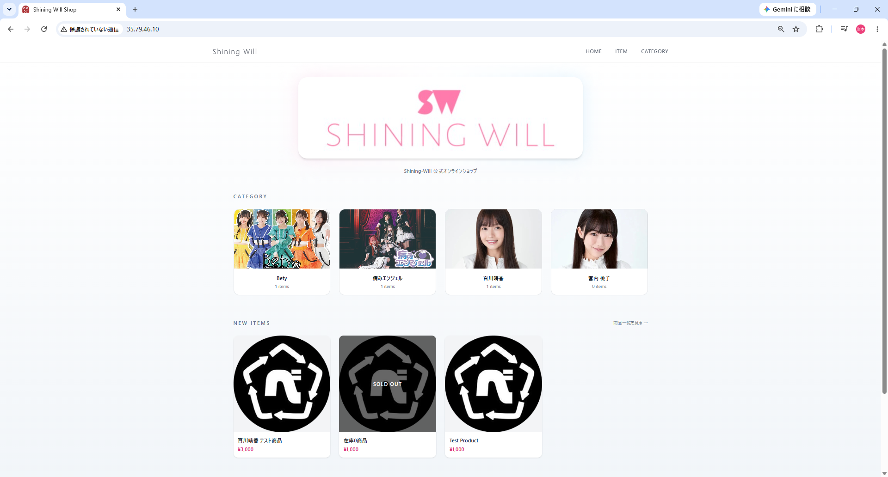

---

## 商品一覧

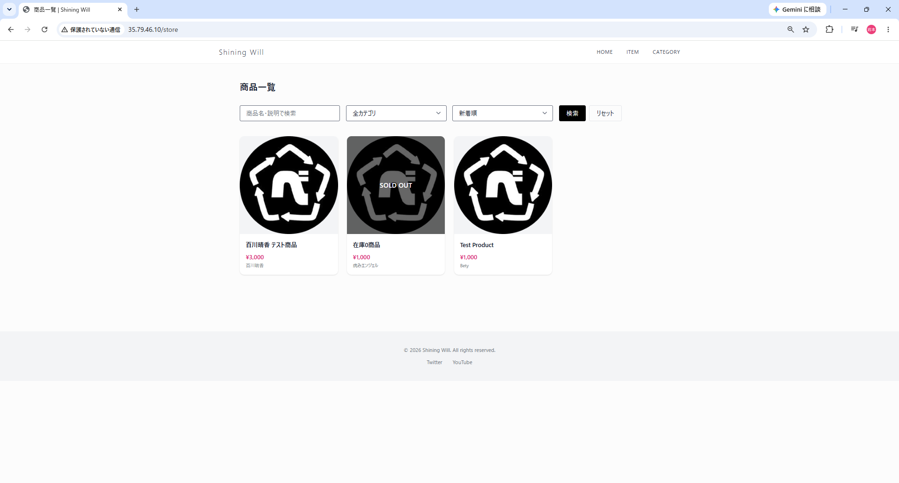

---

## 商品詳細

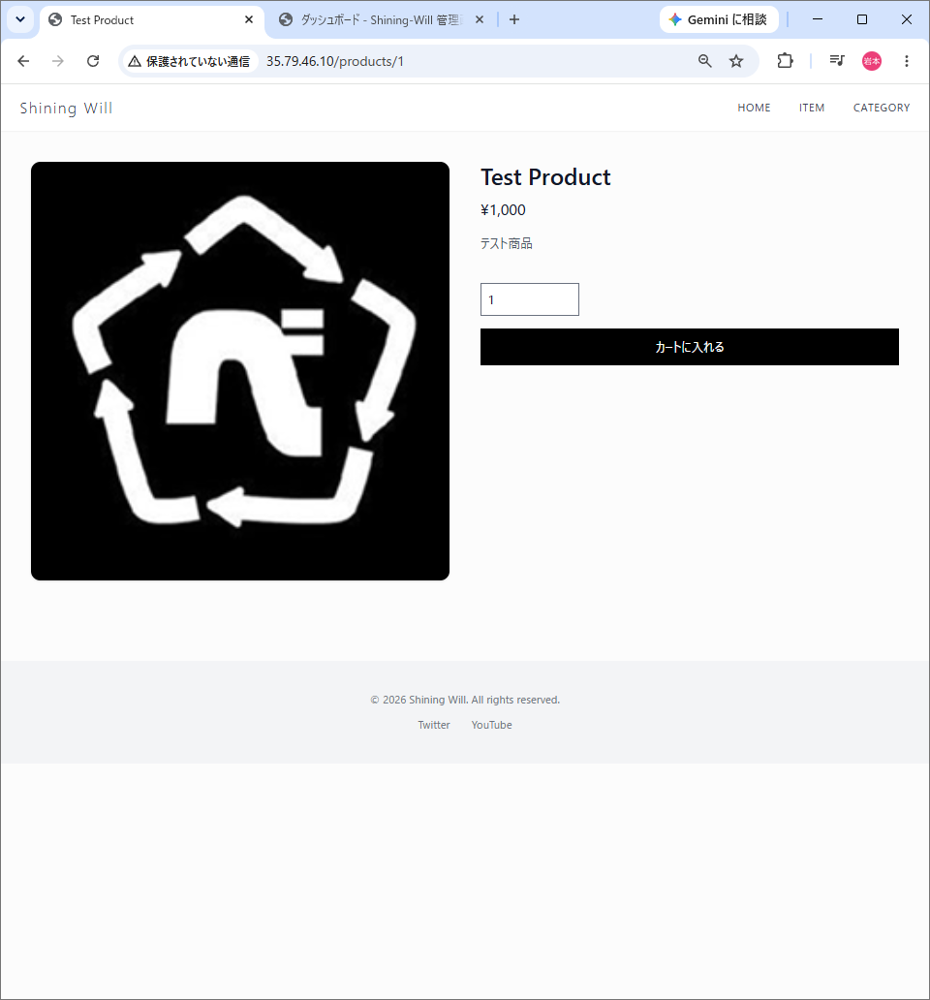

---

## カート

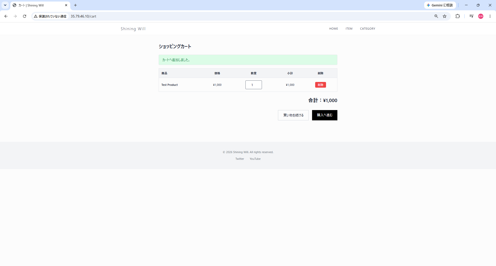

---

## 注文確認

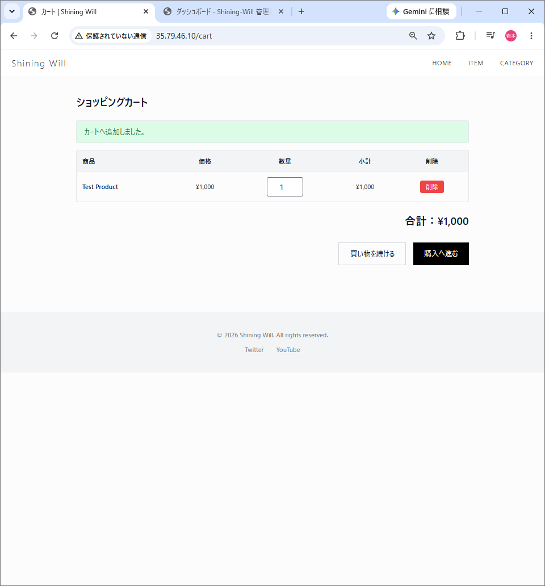

---

## 管理ダッシュボード

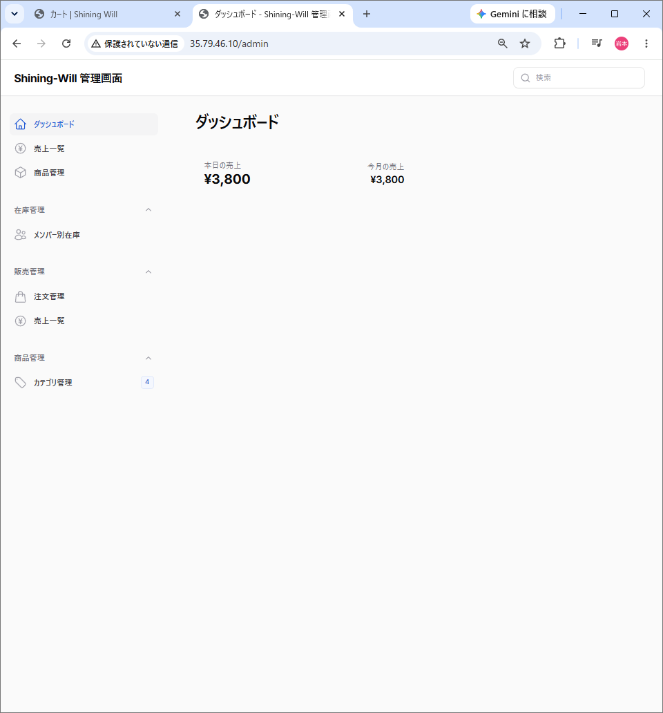

---

## 商品管理

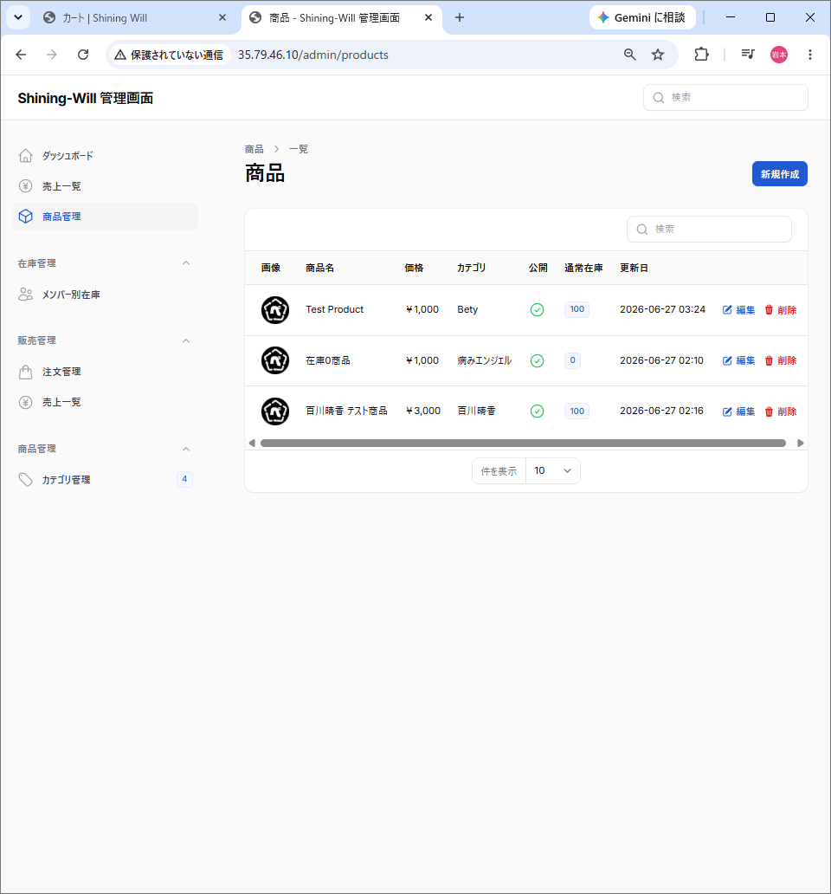

---

## 商品編集

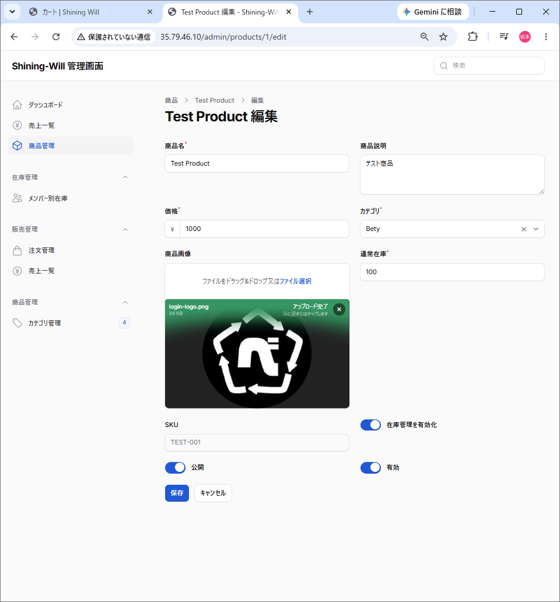

---

## カテゴリ管理

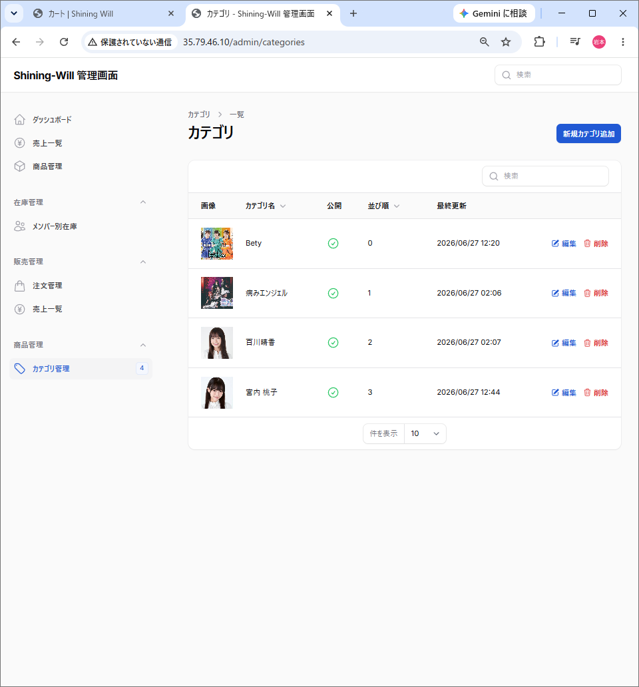

---

## 注文管理

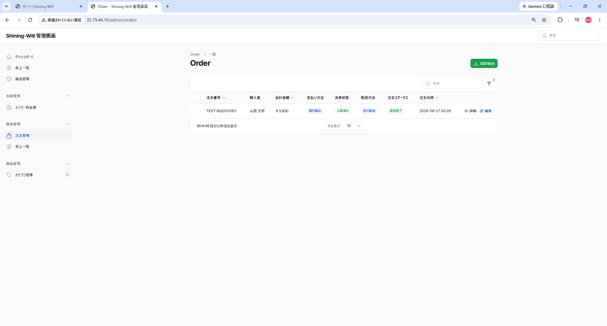

---

# 💡 Project Overview

Shining Will Shop は、アイドル・アーティスト向け公式オンラインショップを想定して開発したECサイトです。

単に画面を作成するだけではなく、

- 商品管理
- カテゴリ管理
- 注文管理
- 在庫管理
- 商品画像管理
- AWSデプロイ

までを一つのWebサービスとして実装しました。

Laravel標準機能を積極的に活用し、

- 保守性
- 拡張性
- 可読性
- データ整合性

を意識した設計を行っています。

また、画像は Amazon S3 に保存し、AWS EC2 上へデプロイすることで、実運用を意識したインフラ構成としています。

---

# ✨ Features

## ユーザー機能

- 商品一覧表示
- 商品詳細表示
- キーワード検索
- カテゴリ検索
- 並び替え
- ページネーション
- カート機能
- 注文確認

---

## 管理者機能

- 商品管理
- カテゴリ管理
- 注文管理
- 商品画像管理
- 商品公開・非公開管理
- 注文ステータス管理

> ※ 決済機能（Square等）は現在未実装です。本ポートフォリオでは、ECサイトのバックエンド設計・管理機能・AWS構成を中心に実装しています。
>
> # 🛠 技術スタック

本プロジェクトでは、Laravelの標準機能を活用しながら、実運用を意識したAWS環境で構築しています。

| Category        | Technology                        |
| --------------- | --------------------------------- |
| Language        | PHP 8.3                           |
| Framework       | Laravel 11                        |
| Admin Panel     | Filament v3                       |
| Frontend        | Blade / Tailwind CSS / JavaScript |
| Build Tool      | Vite                              |
| Database        | MariaDB                           |
| Infrastructure  | AWS EC2                           |
| Web Server      | Nginx                             |
| Image Storage   | Amazon S3                         |
| Development     | Docker / Docker Compose / WSL2    |
| Version Control | Git / GitHub                      |

---

# ☁️ AWS Architecture

本番環境はAWS上へデプロイしています。

画像はAmazon S3へ保存し、Webサーバーとは分離した構成としています。

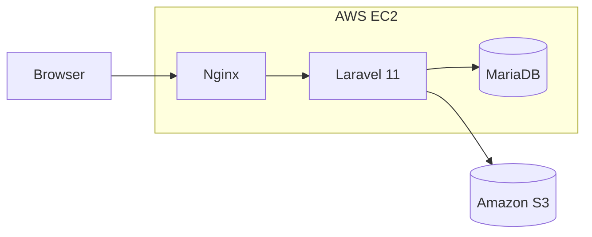

---

# 🏗 Infrastructure

```text
Internet
      │
      ▼
AWS EC2 (Ubuntu 22.04)
      │
      ▼
Nginx
      │
      ▼
Laravel 11
   ├──────────► MariaDB
   │
   └──────────► Amazon S3
```

---

# 📦 Why This Stack?

## Laravel

Laravelを採用した理由は、

* 豊富な標準機能
* 高い保守性
* Eloquent ORM
* Storage
* Validation

などを活用でき、実務でも利用される設計を学ぶことができるためです。

本プロジェクトでは、

* Query Scope
* Eloquent Relationship
* Storage Facade
* Transaction

などLaravel標準機能を積極的に利用しています。

---

## Filament

管理画面はFilamentで構築しました。

Filamentを利用することで、

* CRUD
* Search
* Filter
* Sort
* Form
* Table

などを短期間で実装でき、Laravelとの親和性も高いため採用しました。

実装内容

* 商品管理
* カテゴリ管理
* 注文管理

---

## Amazon S3

商品画像・カテゴリ画像はAmazon S3へ保存しています。

画像をWebサーバーから分離することで、

* サーバー容量削減
* 保存先の抽象化
* 将来的なスケールへの対応

を実現しています。

Laravel Storageを利用することで、

```php
Storage::disk('s3')->put(...)
```

```php
Storage::disk('s3')->url(...)
```

のみで保存・取得できる構成としました。

---

## MariaDB

MariaDBを採用し、

* 商品
* カテゴリ
* 注文
* 注文明細

などをリレーショナルデータベースとして管理しています。

Laravel Eloquentとの親和性も高く、保守性を重視した設計を行いました。

---

## Docker

ローカル開発環境ではDockerを利用しています。

環境差異を最小限に抑え、

* PHP
* MariaDB
* Node.js

などをコンテナ上で統一しています。

---

# 🎯 この構成で意識したこと

このプロジェクトでは、

「動作すること」だけではなく、

* 保守しやすいこと
* 機能追加しやすいこと
* インフラを意識すること

を重視しました。

AWS・Laravel・Amazon S3を組み合わせることで、実際のWebサービスに近い構成を意識しています。

# ✨ Features

本プロジェクトでは、一般ユーザー向けのEC機能と、運営者向けの管理機能を実装しています。

---

# 👤 User Features

## 商品一覧

* 商品一覧表示
* 商品画像表示
* カテゴリ表示
* 在庫状況表示
* 商品詳細画面への遷移

---

## 商品検索

Laravel Query Scope を利用し、

* キーワード検索
* カテゴリ絞り込み
* 並び替え

を実装しています。

```php
Product::query()
    ->published()
    ->keyword($keyword)
    ->category($category)
    ->sort($sort)
    ->paginate(12)
    ->withQueryString();
```

Query Scopeへ処理を集約することで、

* Controllerの肥大化防止
* 再利用性向上
* 可読性向上

を実現しています。

---

## ページネーション

Laravel標準のPaginationを利用しています。

検索条件を保持したままページ遷移できるよう、

```php
->withQueryString()
```

を利用しています。

---

## 商品詳細

商品詳細画面では、

* 商品画像
* 商品説明
* 価格
* 在庫状況

を表示しています。

在庫が無い商品については、

```
SOLD OUT
```

表示となります。

---

## カート

カート機能では、

* 商品追加
* 数量変更
* 商品削除
* 合計金額計算

を実装しています。

---

## 注文確認

注文前に、

* 注文内容
* 配送方法
* 応援メッセージ

を確認できる画面を実装しています。

> ※ 決済機能（Square Payments API）は現在未実装です。

---

# 👨‍💼 Admin Features（Filament）

運営者向けにはFilamentを利用した管理画面を構築しています。

---

## 商品管理

* 商品登録
* 商品編集
* 商品削除
* 公開・非公開切り替え
* 商品画像管理

---

## カテゴリ管理

* カテゴリ登録
* カテゴリ編集
* 表示順管理
* カテゴリ画像管理

---

## 注文管理

注文情報を一覧で管理できます。

管理できる内容

* 注文番号
* 注文日時
* 購入者
* 合計金額
* 注文ステータス
* 配送方法

---

## 注文ステータス

注文状況は以下の状態で管理しています。

* 受付
* 発送準備中
* 発送済み
* 配送完了
* キャンセル

運営側で注文状況を更新できる構成となっています。

---

# 🖼 Image Management

商品画像・カテゴリ画像はAmazon S3へ保存しています。

Laravel Storageを利用することで、

保存先を意識せず画像を扱えるよう設計しています。

```php
Storage::disk('s3')->put(...)
```

```php
Storage::disk('s3')->url(...)
```

Storage Facadeを利用することで、

今後保存先が変更になった場合でも、

アプリケーション側の修正を最小限に抑えられる構成です。

---

# 📌 主な実装機能一覧

| 機能            |     実装    |
| ------------- | :-------: |
| 商品一覧          |     ✅     |
| 商品詳細          |     ✅     |
| 商品検索          |     ✅     |
| カテゴリ検索        |     ✅     |
| 並び替え          |     ✅     |
| ページネーション      |     ✅     |
| カート           |     ✅     |
| 注文確認          |     ✅     |
| 商品管理          |     ✅     |
| カテゴリ管理        |     ✅     |
| 注文管理          |     ✅     |
| 注文ステータス管理     |     ✅     |
| Amazon S3画像管理 |     ✅     |
| AWSデプロイ       |     ✅     |
| 決済機能          | ⏳（今後実装予定） |

---

# 🎯 この章で意識したこと

ECサイトとして必要な基本機能だけでなく、

* 検索性
* 保守性
* 管理性

を重視して実装しました。

特に、検索処理をQuery Scopeへ集約し、管理画面にはFilamentを採用することで、Laravelの標準機能を活かした保守しやすい構成を意識しています。

# 🗄 Database Design

本プロジェクトでは、商品・注文・画像・カテゴリを中心としたデータモデルを設計しています。

データの重複を避け、保守性・拡張性を考慮してテーブルを分割しました。

---

# ER Diagram

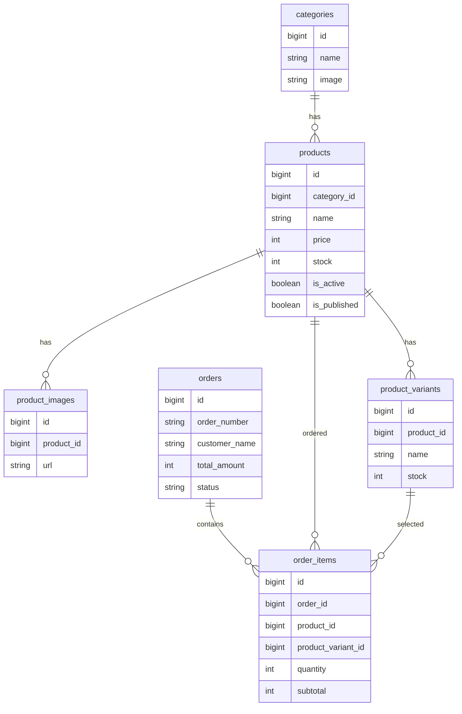

---

# 📦 Database Tables

## Categories

商品のカテゴリを管理します。

主な項目

* カテゴリ名
* カテゴリ画像
* 表示順
* 公開状態

---

## Products

商品情報を管理します。

管理項目

* 商品名
* 商品説明
* SKU
* 価格
* 在庫
* 公開状態

カテゴリとは

```
Category

↓

Products
```

の1対多で関連付けています。

---

## Product Images

商品画像を管理します。

1商品に対して複数枚登録できるよう、

Products

↓

ProductImages

の構成としています。

画像ファイルはAmazon S3へ保存し、

データベースには保存パスのみ保持しています。

---

## Product Variants

商品バリエーションを管理します。

例えば、

* サイズ
* カラー
* メンバー別商品

などへ拡張できる設計です。

通常商品にも対応できるよう、

Productとのリレーションを持っています。

---

## Orders

注文情報を管理します。

保持している情報

* 注文番号
* 購入者情報
* 配送方法
* 合計金額
* 注文ステータス

---

## Order Items

注文商品を管理します。

1回の注文で複数商品を購入できるよう、

Orders

↓

OrderItems

の構成としています。

保存内容

* 商品
* 数量
* 小計

---

# 🔗 Eloquent Relationship

Laravel Eloquentを利用し、

リレーションをModelへ集約しています。

```php
Product

belongsTo(Category)

hasMany(ProductImage)

hasMany(ProductVariant)
```

```php
Order

hasMany(OrderItem)
```

```php
OrderItem

belongsTo(Order)

belongsTo(Product)

belongsTo(ProductVariant)
```

---

# 💡 設計で工夫したこと

## 正規化

画像・カテゴリ・注文明細を独立テーブルとすることで、

* データ重複削減
* 保守性向上
* 将来的な機能追加

を容易にしています。

---

## 画像管理

Productsテーブルへ画像URLを直接持たせず、

ProductImagesテーブルへ分離しました。

これにより、

* 複数画像
* 画像追加
* 画像削除

へ柔軟に対応できます。

---

## 注文設計

OrdersとOrderItemsを分離することで、

1回の注文で

* 商品A
* 商品B
* 商品C

など複数商品の購入へ対応しています。

また、

売上集計や分析処理も行いやすい構成となっています。

---

# 🎯 この設計で意識したこと

本プロジェクトでは、

「画面が動く」

だけではなく、

* データ整合性
* リレーション設計
* 保守性
* 拡張性

を重視しました。

将来的に、

* 決済機能
* 会員機能
* レビュー機能
* お気に入り機能

などを追加しても、

既存テーブルへの影響を最小限に抑えられるデータベース設計を意識しています。

# ⚙️ Design & Implementation

本プロジェクトでは、単に機能を実装するだけではなく、

- 保守性
- 可読性
- 拡張性
- データ整合性

を重視して設計しました。

Laravelの標準機能を積極的に活用し、
責務を適切に分離することを意識しています。

---

# 🔍 Query Scope

検索条件はControllerへ直接記述せず、
ModelのQuery Scopeへ集約しています。

```php
$products = Product::query()
    ->published()
    ->keyword($keyword)
    ->category($category)
    ->sort($sort)
    ->paginate(12)
    ->withQueryString();
```

各Scopeは

- 公開状態
- キーワード
- カテゴリ
- 並び替え

という責務ごとに分離しています。

これにより

- Controllerの肥大化防止
- 再利用性向上
- 可読性向上

を実現しています。

---

# 🔗 Eloquent Relationship

Laravel EloquentのRelationshipを利用し、
テーブル同士を関連付けています。

```php
Product

belongsTo(Category)

hasMany(ProductImage)

hasMany(ProductVariant)
```

```php
Order

hasMany(OrderItem)
```

```php
OrderItem

belongsTo(Order)

belongsTo(Product)

belongsTo(ProductVariant)
```

これにより、

SQLを直接記述する箇所を減らし、

Laravelらしい実装を心掛けました。

---

# ☁️ Amazon S3

商品画像・カテゴリ画像はAmazon S3へ保存しています。

Laravel Storageを利用することで、

```php
Storage::disk('s3')->put(...)
```

取得も

```php
Storage::disk('s3')->url(...)
```

のみで実装しています。

Storage Facadeを利用することで、

保存先が

- Local
- Amazon S3
- Cloud Storage

へ変更になった場合でも、
アプリケーション側の変更を最小限に抑えられます。

---

# 📦 Pagination

商品一覧ではLaravel標準のPaginationを採用しています。

```php
->paginate(12)
->withQueryString();
```

検索条件・カテゴリ・並び替えを保持したまま
ページ遷移できるようにしています。

---

# 🛠 Filament

管理画面はFilamentを利用しています。

実装内容

- 商品管理
- カテゴリ管理
- 注文管理

CRUDだけではなく、

- Search
- Sort
- Filter

などLaravelとの親和性が高い機能を活用しています。

---

# 🎯 責務分離

Controllerへビジネスロジックを書かないことを意識しました。

例えば

```
CheckoutController

↓

Order::decreaseStock()

↓

Product
ProductVariant
```

という責務分離を行っています。

また、

Viewでは表示のみを担当し、

複雑な判定はModelへ集約しています。

例えば

```php
$product->isSoldOut()

$product->totalStock()

$product->isAvailableForSale()
```

のように、

意味が分かるメソッドを利用しています。

---

# 💡 この章で伝えたいこと

このプロジェクトでは、

「動くアプリケーション」

を作るだけではなく、

Laravel標準機能を活用しながら、

- 保守性
- 拡張性
- 再利用性

を意識した設計を心掛けました。

今後機能追加を行う場合でも、
既存コードへの影響を最小限に抑えられる構成を目指しています。

# 🔄 Order Flow & Inventory Management

ECサイトでは、

「注文だけ保存される」

「在庫だけ更新される」

といった不整合が発生しないことが重要です。

本プロジェクトでは、LaravelのTransactionと排他制御を利用し、安全に注文処理を行うよう設計しています。

---

# 📋 Order Flow

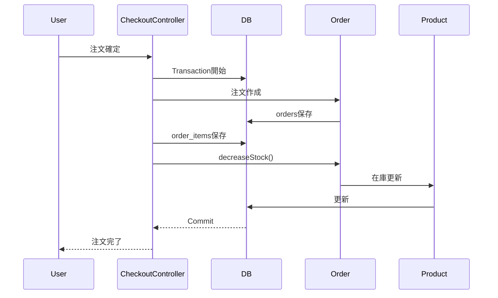

---

# 🔒 Transaction

注文処理では、

以下を**1つのTransaction**として実行しています。

- 注文情報作成
- 注文明細作成
- 在庫更新

途中で例外が発生した場合は、

```php
DB::rollBack();
```

を実行し、

注文情報・注文明細・在庫更新をすべて取り消します。

これにより、

- 注文だけ保存される
- 在庫だけ更新される

といったデータ不整合を防いでいます。

---

# 🔐 lockForUpdate()

在庫更新では、

```php
lockForUpdate()
```

を利用しています。

```php
$product = Product::query()
    ->lockForUpdate()
    ->find($item->product->id);
```

これにより、

複数ユーザーが同時に購入した場合でも、

- 二重購入
- 在庫マイナス

などを防止できます。

ECサイトでは重要となる排他制御を意識して実装しました。

---

# 📦 Inventory Update

注文確定後、

```php
$order->decreaseStock();
```

を実行し、

Orderモデルへ在庫更新処理を集約しています。

通常商品

```php
$product->decrement('stock', $qty);
```

バリエーション商品

```php
$variant->decrement('stock', $qty);
```

のように、

商品種別によって更新先を切り替えています。

---

# 🧩 Product Variant Support

商品バリエーションが存在する場合は、

Productではなく、

ProductVariant

の在庫を更新しています。

これにより、

- サイズ違い
- カラー違い
- メンバー別商品

などへ拡張できる構成になっています。

---

# 🏛 Responsibility Separation

在庫更新はControllerへ実装せず、

Orderモデルへ責務を集約しました。

```text
CheckoutController

↓

Order::decreaseStock()

↓

Product
ProductVariant
```

Controllerは

- 注文受付
- Transaction管理

のみを担当し、

ビジネスロジックはModelへ集約しています。

---

# 🎯 この設計で意識したこと

本プロジェクトでは、

「注文できる」

だけではなく、

ECサイトとして重要な

- データ整合性
- 排他制御
- 責務分離
- 保守性

を重視しました。

特に、

Laravel Transaction

lockForUpdate()

Modelへの責務集約

を組み合わせることで、

実務でも保守しやすい構成を目指しています。

この考え方は、今後決済機能や会員機能などを追加する際にも活かせるよう設計しています。

# 🚀 Setup

## Requirements

本プロジェクトの動作環境です。

| Software | Version |
|----------|---------|
| PHP | 8.3 |
| Laravel | 11 |
| MariaDB | 10.x |
| Node.js | 20+ |
| Composer | Latest |
| npm | Latest |

---

# Clone

```bash
git clone https://github.com/utl-flaxy/shining-will-shop.git

cd shining-will-shop
```

---

# Install

```bash
composer install

npm install
```

---

# Environment

```bash
cp .env.example .env

php artisan key:generate
```

データベース接続情報やAmazon S3の認証情報を`.env`へ設定してください。

---

# Database

```bash
php artisan migrate

php artisan db:seed
```

---

# Storage

ローカル環境

```bash
php artisan storage:link
```

本番環境ではAmazon S3を利用しています。

---

# Build

開発時

```bash
npm run dev
```

本番ビルド

```bash
npm run build
```

---

# Start

ローカル環境

```bash
php artisan serve
```

---

# ☁ AWS Deployment

本番環境はAWS上へデプロイしています。

## Infrastructure

- AWS EC2
- Ubuntu 22.04
- Nginx
- PHP-FPM
- MariaDB
- Amazon S3

---

## Deploy Flow

```text
GitHub

↓

EC2

↓

git pull

↓

composer install --no-dev

↓

npm run build

↓

php artisan migrate --force

↓

php artisan optimize

↓

Nginx Restart
```

---

## Deploy Commands

```bash
git pull

composer install --no-dev

npm install

npm run build

php artisan migrate --force

php artisan optimize

sudo systemctl restart php8.3-fpm

sudo systemctl restart nginx
```

---

# ✅ 動作確認

以下の動作を確認しています。

## Front

- TOPページ
- 商品一覧
- 商品詳細
- 商品検索
- カテゴリ検索
- 並び替え
- ページネーション
- カート
- 注文確認

---

## Admin

- 商品登録
- 商品編集
- 商品削除
- カテゴリ管理
- 注文管理
- 注文ステータス更新

---

## Amazon S3

- 商品画像アップロード
- 商品画像表示
- カテゴリ画像アップロード
- カテゴリ画像表示

---

## Inventory

- 通常商品の在庫更新
- バリエーション商品の在庫更新
- Transactionによる整合性維持

---

# 📌 Notes

本ポートフォリオは、ECサイトのバックエンド設計・管理画面・AWS環境構築を中心に実装しています。

現在、決済機能は実装していません。

今後はSquare Payments APIなどを利用した決済機能を追加し、より実運用に近いECサイトへ発展させる予定です。

# 🚀 Future Improvements

本プロジェクトでは、ECサイトとして必要な基本機能を実装しました。

一方で、実運用を想定すると、さらに改善できる点も多くあります。

今後は以下の機能追加・改善に取り組みたいと考えています。

---

## 決済機能

現在は注文確認・注文管理・在庫管理までを実装しています。

今後はSquare Payments APIなどを利用し、

- クレジットカード決済
- 決済完了後の注文確定
- 決済失敗時のロールバック
- Webhook連携

などを実装し、実際のECサイトに近い構成へ発展させたいと考えています。

---

## 会員機能

現在はゲスト購入を前提としています。

今後は

- 会員登録
- ログイン
- マイページ
- 注文履歴

などを追加し、ユーザー体験を向上させたいと考えています。

---

## テストコード

現在は手動による動作確認を中心に開発を進めています。

今後はPHPUnitを用いて

- Unit Test
- Feature Test

を追加し、品質向上を図りたいと考えています。

---

## CI/CD

現在はAWS EC2へ手動でデプロイを行っています。

デプロイ時は以下の手順で反映しています。

- git pull
- composer install
- npm run build
- php artisan migrate --force
- php artisan optimize
- Nginx / PHP-FPM 再起動

今後はGitHub Actionsを導入し、

- 自動テスト
- 自動ビルド
- AWS EC2への自動デプロイ

まで含めたCI/CDパイプラインを構築する予定です。

---

## パフォーマンス改善

画像はAmazon S3で管理していますが、

今後はCloudFrontを導入し、

- CDN配信
- キャッシュ最適化
- 表示速度向上

にも取り組みたいと考えています。

---

# 📚 What I Learned

本プロジェクトでは、Laravelを利用したWebアプリケーション開発だけではなく、

- データベース設計
- AWSへのデプロイ
- Amazon S3による画像管理
- Filamentによる管理画面構築

まで、一連の開発工程を経験しました。

特に、

- Query Scopeによる検索処理の共通化
- Eloquent Relationshipを活用したデータ設計
- Transaction・`lockForUpdate()`を利用した在庫管理
- Storage Facadeを利用した画像管理

など、Laravelの標準機能を活かした設計・実装を学ぶことができました。

また、「画面が動くこと」だけではなく、

- 保守性
- 拡張性
- 可読性
- データ整合性

を意識して設計することの重要性を学びました。

---

# 🙇 Conclusion

最後までREADMEをご覧いただき、ありがとうございました。

このプロジェクトでは、Laravelを中心に、AWS・MariaDB・Amazon S3・Filamentを組み合わせ、ECサイトの企画から設計・実装・デプロイまで一貫して取り組みました。

今後も、保守性・拡張性を意識した設計を大切にしながら、新しい技術にも積極的に挑戦し、より実践的なWebアプリケーション開発に取り組んでいきます。

ご意見やフィードバックをいただけますと幸いです。
