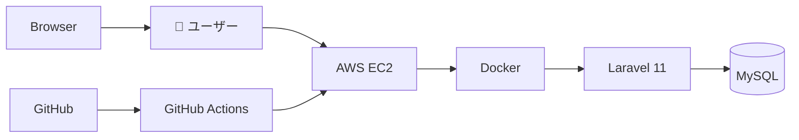
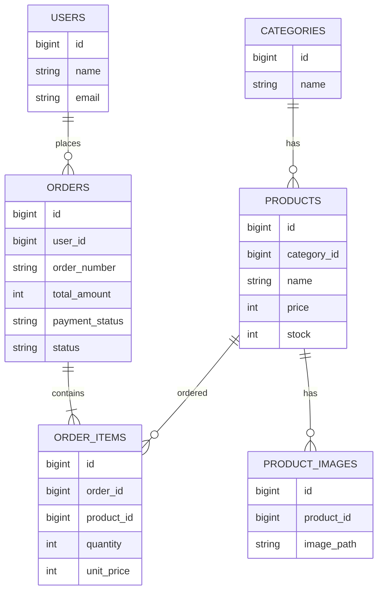
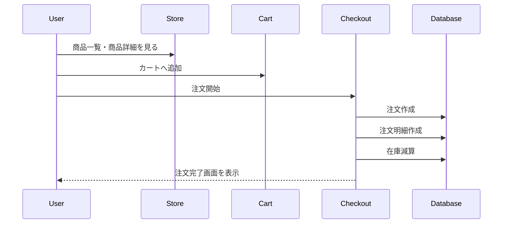

# 🛍️ Shining Will Shop

> Laravel 11で開発した、アイドル・アーティスト向けECサイトです。  
> 商品販売だけではなく、認証・注文・在庫管理・管理画面・自動テスト・CIまで実装し、実務を意識したWebアプリケーションとして設計しました。

---

## デモ

🌐 **本番環境**

https://shining-will-shop.com

---

## GitHub

https://github.com/utl-flaxy/shining-will-shop

---

# 技術スタック

| 分類 | 技術 |
|------|------|
| Backend | Laravel 11 / PHP 8.3 |
| Frontend | Blade / Tailwind CSS / Vite |
| Database | MySQL |
| ORM | Eloquent ORM |
| Authentication | Laravel Breeze |
| Admin | Filament v3 |
| Testing | PHPUnit |
| CI | GitHub Actions |
| Development | Docker |
| Infrastructure | AWS EC2 |

---

# プロジェクト概要

Shining Will Shop は、アイドル・アーティスト向けのグッズ販売を想定したECサイトです。

単純なCRUDアプリケーションではなく、

- 会員認証
- 商品管理
- カテゴリー管理
- カート
- 注文
- 在庫管理
- 管理画面
- 自動テスト
- GitHub Actions

まで含めた、実務を意識したWebアプリケーションとして設計・実装しました。

本プロジェクトでは

**「機能数を増やすこと」ではなく、「保守しやすく継続的に改善できる設計」**

をテーマとしています。

---

# システム全体像

## AWS構成図



GitHubでソースコードを管理し、GitHub Actionsで自動テストを実行しています。

本番環境はAWS EC2へデプロイし、Docker上でLaravelとMySQLを動作させています。

---

## ER図



商品・注文・ユーザーを正規化し、注文時の商品情報を保持できるよう設計しています。

---

## 注文フロー



注文処理では、注文・注文明細・在庫更新を1つのトランザクションとして実行し、データ整合性を保っています。

---

# このプロジェクトで重視したこと

本プロジェクトでは、以下の4点を重視して設計・実装しました。

- 保守しやすい設計
- Laravel標準機能を活用した実装
- Feature Testによる品質保証
- GitHub Actionsによる継続的インテグレーション

また、「どう実装したか」だけではなく、

**「なぜその設計を選択したのか」**

という設計意図を重視しています。

---

# READMEの構成

このREADMEでは、機能紹介だけではなく、設計思想や品質への取り組みについても説明します。

1. 開発背景
2. 技術選定
3. アーキテクチャ
4. 設計レビュー
5. 実装機能
6. 品質保証
7. 今後改善したいこと
8. セットアップ

実装内容だけでなく、設計上の判断やトレードオフについても記載しています。

# 開発背景

Laravelの学習では、CRUDアプリケーションを作成する機会は多くありますが、

実務では

- 認証
- 商品管理
- 注文管理
- 在庫管理
- データ整合性
- テスト
- CI

まで含めて設計・実装する必要があります。

そのため本プロジェクトでは、

「ECサイトを作ること」

ではなく、

**実務で継続的に運用できるWebアプリケーションを設計・実装すること**

を目的として開発しました。

また、単に機能を実装するだけではなく、

- 保守性
- 可読性
- 拡張性
- 品質保証

を重視しています。

---

# 開発目標

本プロジェクトでは、以下の3点を目標としました。

## 1. Laravel標準機能を活用する

過度な独自実装は避け、

Laravelが提供する機能を積極的に利用しています。

これにより、

- 可読性
- 保守性
- 学習コスト

を高めています。

---

## 2. 保守しやすい設計

実務では機能追加よりも、

既存コードの修正・改善を行う時間の方が長くなります。

そのため、

後から見ても理解しやすい構成を意識しました。

具体的には、

- Controllerを薄くする
- Modelへ責務を集約する
- Query Scopeを利用する

など、

責務分離を意識した設計を採用しています。

---

## 3. 品質を継続的に維持する

実装したコードが今後も正しく動作するよう、

Feature TestとGitHub Actionsを導入しています。

変更しても既存機能が壊れない状態を維持できる構成を目指しました。

---

# 技術選定

## Laravel 11

Laravelは、

ルーティング・認証・ORM・メール送信・Migrationなど、

Webアプリケーション開発に必要な機能が標準で揃っています。

本プロジェクトでは、

Laravel標準機能を活用することで、

保守性と開発効率を両立しました。

---

## Filament

管理画面にはFilamentを採用しています。

採用理由

- Laravelとの親和性が高い
- CRUDを高速に構築できる
- カスタマイズしやすい
- 実務でも利用事例が多い

管理画面を短期間で構築できたことで、

業務ロジックの設計・実装に集中できました。

---

## MySQL

本番環境ではMySQLを採用しています。

Laravelとの相性が良く、

実務でも広く利用されているためです。

また、

ローカル環境・本番環境ともにMySQLを利用することで、

環境差異を減らしています。

---

## Docker

開発環境はDocker Composeで構築しています。

これにより、

誰でも同じ環境で開発を開始できるようにしています。

環境構築手順を統一することで、

「ローカルでは動くが他環境では動かない」

という問題を防いでいます。

---

## GitHub Actions

Push・Pull Request時に、

自動でFeature Testを実行しています。

ローカル環境だけではなく、

GitHub上でも品質確認を行うことで、

環境差異による不具合を早期に発見できる構成としています。

---

## AWS EC2

本番環境はAWS EC2へデプロイしています。

Docker上でLaravel・MySQLを動作させ、

実務に近いインフラ構成を経験することを目的としました。

---

# アーキテクチャ

本プロジェクトでは、

Laravel標準のMVCアーキテクチャを採用しています。

```text
Request
    │
    ▼
Route
    │
    ▼
Controller
    │
    ▼
Model
    │
    ▼
Database
    │
    ▼
View
```

Laravelの標準構成を尊重し、

過度な抽象化を避けています。

---

# 責務分離

各レイヤーの責務を明確に分離しています。

| レイヤー | 主な責務 |
|----------|----------|
| Route | URLとControllerの紐付け |
| Controller | HTTPリクエスト・レスポンス |
| Model | ビジネスロジック・データ操作 |
| View | 画面表示 |
| Migration | テーブル定義 |
| Feature Test | エンドツーエンドの動作確認 |

---

# 設計で意識したこと

本プロジェクトでは、

「デザインパターンを使うこと」

ではなく、

**プロジェクト規模に応じた適切な設計を選択すること**

を重視しました。

そのため、

- Laravel標準機能を活用する
- Controllerを肥大化させない
- ビジネスロジックをModelへ集約する
- 可読性を優先する
- 過度な抽象化を避ける

という方針で開発しています。

実装時だけでなく、

数か月後の自分や他の開発者が理解しやすいコードを書くことを意識しました。

# 設計レビュー

本プロジェクトでは、「機能を実装すること」だけではなく、

**保守性・可読性・拡張性を考慮した設計**

を重視しました。

Laravelには多くの設計パターンがありますが、

プロジェクト規模に対して過度な抽象化は行わず、

Laravel標準機能を最大限活用する構成を採用しています。

---

# Controllerを薄くする設計

Controllerでは、

- リクエスト受付
- バリデーション
- レスポンス生成

のみを担当しています。

ビジネスロジックはできる限りModelへ集約しました。

```text
Request

↓

Controller

↓

Model

↓

Database

↓

Response
```

Controllerへロジックを書き続けると、

コード量が増えた際に可読性・保守性が低下します。

そのため、

HTTP処理とビジネスロジックを明確に分離しています。

---

# Query Scopeによる検索処理

商品検索では、

- キーワード検索
- カテゴリー検索
- 最低価格
- 最高価格
- 並び替え
- 公開商品のみ表示

など複数条件があります。

これらをControllerへ直接記述すると、

検索条件が増えるたびにControllerが肥大化します。

そこで、

検索ロジックはQuery Scopeへ集約しました。

```php
Product::query()
    ->published()
    ->keyword($keyword)
    ->category($category)
    ->priceRange($minPrice, $maxPrice)
    ->sort($sort)
    ->paginate(12);
```

### 採用した理由

- Controllerをシンプルに保てる
- 検索条件の追加が容易
- 他画面からも再利用できる
- Feature Testを書きやすい

---

# Eloquent Relationship

SQLを直接記述するのではなく、

Laravel標準のRelationshipを利用しています。

```text
Category

↓

Products

↓

ProductImages
```

注文では

```text
Order

↓

OrderItems

↓

Product
```

という構成です。

### 採用した理由

- Laravelらしい実装になる
- Eager LoadingによるN+1問題を回避しやすい
- 保守性が高い

---

# Session Cart

カートはSessionで管理しています。

### メリット

- 実装がシンプル
- ゲスト購入に対応しやすい
- DBアクセスを削減できる

### デメリット

- 複数端末で同期できない
- ログイン時の統合処理が必要

今回は、

ポートフォリオとして

「実装コスト」と「保守性」のバランスを考え、

Session Cartを採用しました。

将来的に会員機能を拡張する場合は、

Redisまたはデータベース管理への移行を想定しています。

---

# 注文処理とトランザクション

注文処理では、

複数テーブルを更新します。

```text
注文作成

↓

注文明細作成

↓

在庫減算

↓

メール送信

↓

コミット
```

途中で例外が発生した場合は、

すべてロールバックします。

```php
DB::transaction(function () {

    // 注文作成

    // 注文明細作成

    // 在庫減算

    // メール送信

});
```

### 採用した理由

注文だけ保存され、

在庫だけ減少するような

データ不整合を防ぐためです。

ECサイトでは注文データの整合性が重要であるため、

トランザクションを採用しています。

---

# Filamentを採用した理由

管理画面はFilament v3を利用しています。

### 採用理由

- Laravelとの親和性が高い
- CRUDを高速に構築できる
- 拡張性が高い
- 実務でも利用事例が増えている

管理画面の実装コストを削減できたため、

注文処理や検索機能など、

アプリケーション本体の設計・実装に時間を使うことができました。

---

# 採用しなかった設計

本プロジェクトでは、

Service LayerやRepository Patternは採用していません。

### 理由

現時点のプロジェクト規模では、

Laravel標準のEloquent ORMだけで十分に責務を分離できると判断しました。

無理にレイヤーを増やすと、

ファイル数が増え、

コードを追いにくくなる可能性があります。

一方で、

今後以下のような要件が増えた場合には導入を検討します。

- 外部APIとの連携が増える
- 複雑なドメインロジックが増える
- 永続化処理を切り替える必要がある

プロジェクト規模に応じて設計を見直すことを前提としています。

---

# 設計上のトレードオフ

本プロジェクトでは、

「設計パターンを使うこと」

ではなく、

**プロジェクト規模に対して適切な設計を選択すること**

を重視しました。

例えば、

| 選択 | 理由 |
|------|------|
| Session Cart | シンプルで保守しやすい |
| Query Scope | 検索処理を共通化できる |
| Eloquent | Laravel標準で保守性が高い |
| Filament | 管理画面を高速開発できる |
| Docker | 開発環境を統一できる |
| GitHub Actions | 継続的に品質を確認できる |

将来的にシステム規模が拡大した場合は、

設計を見直しながら改善していくことを前提としています。

---

# この章で伝えたいこと

本プロジェクトでは、

「動作するコードを書くこと」だけではなく、

**将来の機能追加や保守まで考慮した設計**

を意識しました。

Laravel標準機能を活用しながら、

必要以上に複雑な構成を避け、

読みやすく保守しやすいコードベースを目指しています。

# 実装機能

## ユーザー向け

- 会員登録・ログイン
- 商品一覧
- 商品検索
- カテゴリー検索
- 商品詳細
- カート
- 注文
- 注文履歴
- プロフィール編集

---

## 管理画面

Filamentを利用して以下を管理できます。

- 商品管理
- カテゴリー管理
- 注文管理
- ユーザー管理
- ダッシュボード

---

# 品質保証

本プロジェクトでは、

「動くコードを書くこと」

だけではなく、

「安心して変更できるコードを書くこと」

を重視しています。

---

## Feature Test

主要機能についてFeature Testを実装しています。

対象

- 認証
- 商品検索
- カート
- 注文
- プロフィール

現在の結果

```text
48 Tests

130 Assertions

All Passed ✅
```

HTTPリクエストからデータベース更新までを確認し、

アプリケーション全体として期待どおりに動作することを検証しています。

---

## GitHub Actions

GitHub Actionsを導入し、

Push・Pull Request時に

自動でテストを実行しています。

CIで確認している内容

- Composer Install
- Migration
- PHPUnit
- Laravel Boot

ローカル環境だけではなく、

GitHub上でも品質を確認できる構成にしています。

---

## テスト環境

テストではSQLiteを利用しています。

理由

- テスト実行が高速
- 毎回クリーンなDBで開始できる
- CIとの相性が良い

各テストでは

```php
use RefreshDatabase;
```

を利用し、

テスト同士が影響しない構成としています。

---

# 今後改善したいこと

今後は以下の機能追加・改善を予定しています。

### EC機能

- Square決済対応
- 決済Webhook
- 商品レビュー
- お気に入り
- クーポン
- ポイント機能

### インフラ

- CloudFront
- S3画像配信最適化
- キャッシュ戦略の改善

### システム

- PWA対応
- 通知機能
- 多言語対応

---

# セットアップ

## 必要環境

- PHP 8.3
- Composer
- Docker
- Node.js
- MySQL

---

## インストール

```bash
git clone https://github.com/utl-flaxy/shining-will-shop.git

cd shining-will-shop

composer install

npm install

cp .env.example .env

php artisan key:generate

php artisan migrate

php artisan storage:link

npm run dev

php artisan serve
```

---

# このプロジェクトを通して学んだこと

このプロジェクトでは、

ECサイトを構築するだけではなく、

保守性・品質・継続的な改善を意識した開発を経験しました。

特に、

- Laravel標準機能を活用した設計
- 責務分離
- データ整合性
- Feature Test
- GitHub Actions

の重要性を実践を通して学びました。

また、

実装を進める中で、

「まず動くものを作る」

ことよりも、

「あとから変更しやすい構成を作る」

ことの重要性を実感しました。

---

# おわりに

本プロジェクトでは、

Laravelを利用したECサイト開発を通して、

設計・実装・テスト・CI・インフラまで一貫して経験しました。

単に機能を実装するだけではなく、

**「継続的に改善できるWebアプリケーションを設計すること」**

をテーマに開発しています。

今後も改善を継続し、

より保守性・拡張性の高いアプリケーションへ発展させていく予定です。

---

## 作者

GitHub

https://github.com/utl-flaxy

Portfolio

https://shining-will-shop.com
